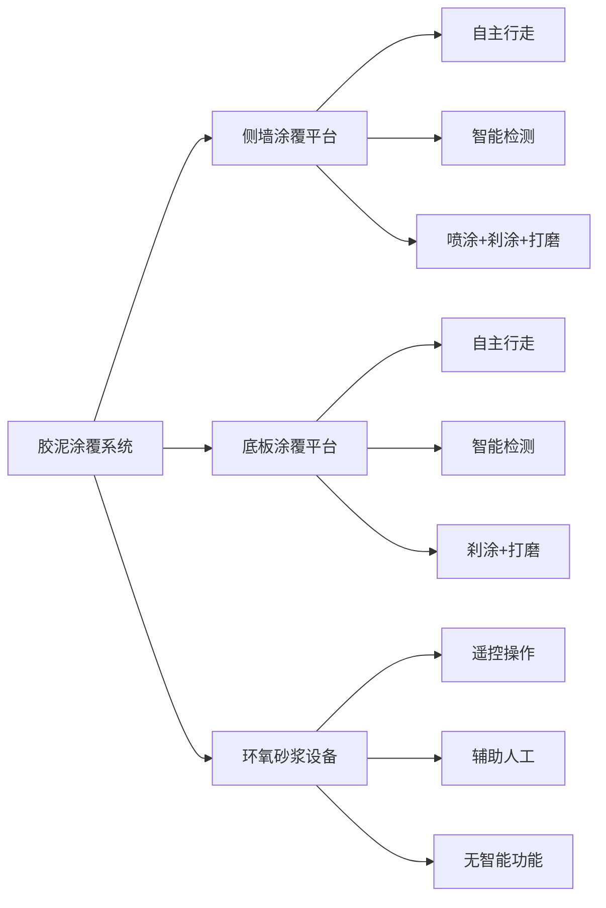
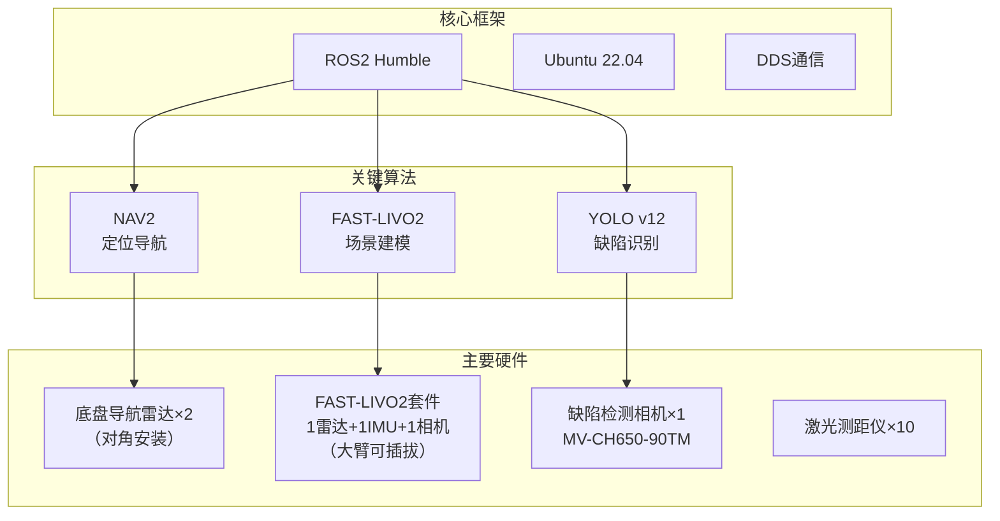
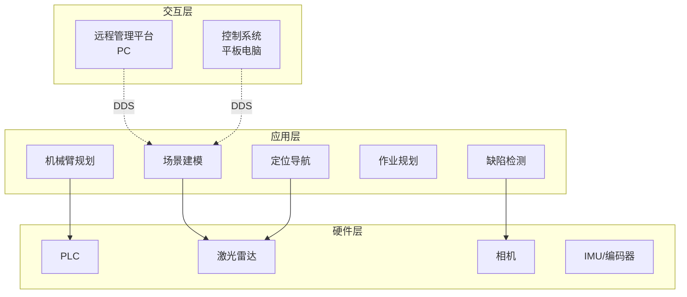
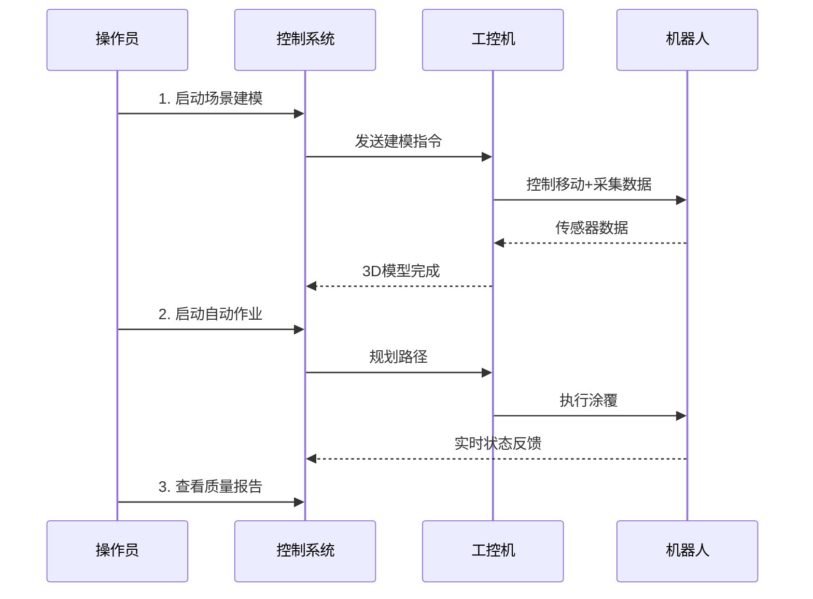

# 胶泥项目软件概览

> 面向管理层和新成员的项目简介

---

## 1. 项目背景

### 1.1 项目定位
本项目旨在开发**胶泥涂覆机器人系统**的软件部分，实现**室外侧墙和底板**的自动化检测与涂覆作业，以及**环氧砂桨作业装备的手动控制、辅助人工**相关功能。

### 1.2 核心目标
- ✅ 替代人工作业，提升施工效率和质量
- ✅ 实现智能检测（缺陷识别、厚度测量）
- ✅ 提供远程监控和自动化控制能力（侧墙/底板平台）
- ✅ 保证施工精度（检测精度0.1mm，涂覆厚度可控）
- ✅ 辅助遥控操作（环氧砂浆设备）

---

## 2. 系统组成

### 2.1 三套作业装备

**设备功能对比**：

| 设备 | 自主行走 | 智能检测 | 自动涂覆 | 功能列表 |
|------|----------|----------|----------|----------|
| **侧墙平台** | ✅ | ✅ | ✅ | 喷涂、刹涂、打磨 |
| **底板平台** | ✅ | ✅ | ✅ | 刹涂、打磨（无喷涂） |
| **环氧砂浆设备** | ❌ | ❌ | ❌ | 仅遥控操作+辅助人工 |

### 2.2 软件系统构成

| 系统 | 运行平台 | 主要功能 |
|------|----------|----------|
| **远程可视化管理平台** | PC | 远程监控、进度可视化、远程制动 |
| **控制系统** | 平板电脑（12寸触屏） | 现场手动/自动控制、状态监测 |
| **工控机软件** | 工控机 | SLAM建图、AI检测、导航规划 |

---

## 3. 关键技术

### 3.1 技术栈总览

### 3.2 技术亮点
- 🤖 **ROS2生态**：使用工业级机器人操作系统
- 📡 **DDS通信**：高可靠性、低延迟的分布式通信
- 🧠 **AI视觉**：深度学习缺陷检测（0.1mm精度）
- 🗺️ **激光SLAM**：3D场景重建与精确定位

---

## 4. 系统架构

### 4.1 总体架构

### 4.2 组网方案
- **方案选择**：WIFI6 大功率无线路由器
- **覆盖范围**：3公里（通过mesh拓展）
- **备用方案**：4G/5G工业路由器

---

## 5. 工作流程

### 5.1 典型作业流程

---

## 6. 项目里程碑

### 6.1 开发计划（待完善）

| 阶段 | 时间 | 交付物 | 状态 |
|------|------|--------|------|
| 需求确认 | 2025-03 | 需求规格说明书 | ✅ 已完成 |
| 概要设计 | 2025-04 ~ 2025-09 | 系统架构设计 | ✅ 已完成 |
| 详细设计 | 2025-10 ~ 2026-01 | 接口设计文档 | ✅ 已完成 |
| 开发实施 | 2026-01 ~ 2026-05 | 软件原型 | ✅ 已完成 |
| 集成测试 | 2026-06 ~ 2026-11 | 测试报告 | ⏳ 待开始 |
| 现场验证 | 2026-12 | 验收报告 | ⏳ 待开始 |

---

## 7. 风险与应对

### 7.1 Top 5 技术风险

| 风险 | 影响 | 概率 | 应对措施 |
|------|------|------|----------|
| **相机精度达不到0.1mm** | 高 | 中 | ①使用MV-CH650-90TM高精度相机 ②主动光源稳定照明 ③准备降级方案 |
| **WIFI6室外信号弱** | 中 | 中 | ①4G/5G备用方案 ②QoS优先级策略 ③现场信号测试 |
| **工控机性能不足** | 高 | 低 | ①性能基准测试 ②算法优化 ③任务优先级调度 |
| **FAST-LIVO2实时性** | 中 | 低 | ①已经过初步验证 ②离线建图方案 |

### 7.2 缓解措施
- ✅ 关键技术提前预研验证
- ✅ 硬件选型留有性能余量
- ✅ 制定降级和备用方案
- ✅ 建立风险监控机制

---

## 8. 下一步工作

详见 [TODO清单](./TODO.md)

---

## 附录：术语表

| 术语 | 全称 | 说明 |
|------|------|------|
| ROS2 | Robot Operating System 2 | 机器人操作系统第二代 |
| DDS | Data Distribution Service | 数据分发服务（通信中间件） |
| SLAM | Simultaneous Localization and Mapping | 即时定位与地图构建 |
| NAV2 | Navigation 2 | ROS2导航框架 |
| PLC | Programmable Logic Controller | 可编程逻辑控制器 |
| IMU | Inertial Measurement Unit | 惯性测量单元 |
| FOV | Field of View | 视场角 |
