# 系统架构设计

> 软件系统的核心设计文档

---

## 1. 架构概览

### 1.1 总体架构

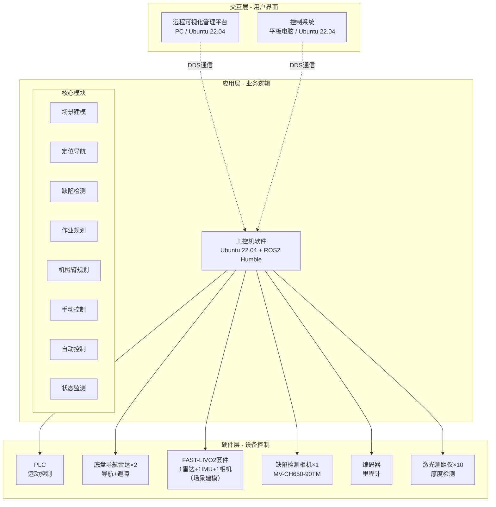

### 1.2 软件清单

| 软件名称 | 运行平台 | 开发框架 | 主要功能 | 适用设备 |
|----------|----------|----------|----------|----------|
| 远程可视化管理平台 | PC (Ubuntu 22.04) | Qt + ROS2 | 远程监控、进度可视化、远程制动 | 所有设备 |
| 控制系统 | 平板电脑 (Ubuntu 22.04) | Qt + ROS2 | 手动/自动控制、状态监测 | 所有设备 |
| 工控机软件 | 工控机 (Ubuntu 22.04) | ROS2 Humble | SLAM、AI检测、导航、手动控制、传感器上报 | 所有设备 |

**说明**：
- 所有设备均采用ROS2架构，保证架构统一性和可扩展性
- 对于工控机软件，三个设备使用**同一套软件代码**，通过launch配置文件和参数实现功能差异化：
  - **智能平台配置**（侧墙、底板）：启动全部节点（导航+检测+控制）
  - **简化平台配置**（环氧砂浆）：仅启动基础节点（手动控制+传感器上报+安全监控）
- 对于控制系统，三个设备也使用**同一套软件代码**，通过配置实现功能差异化
- 功能开关通过`robot_type`参数控制，避免维护多套代码

### 1.3 技术栈

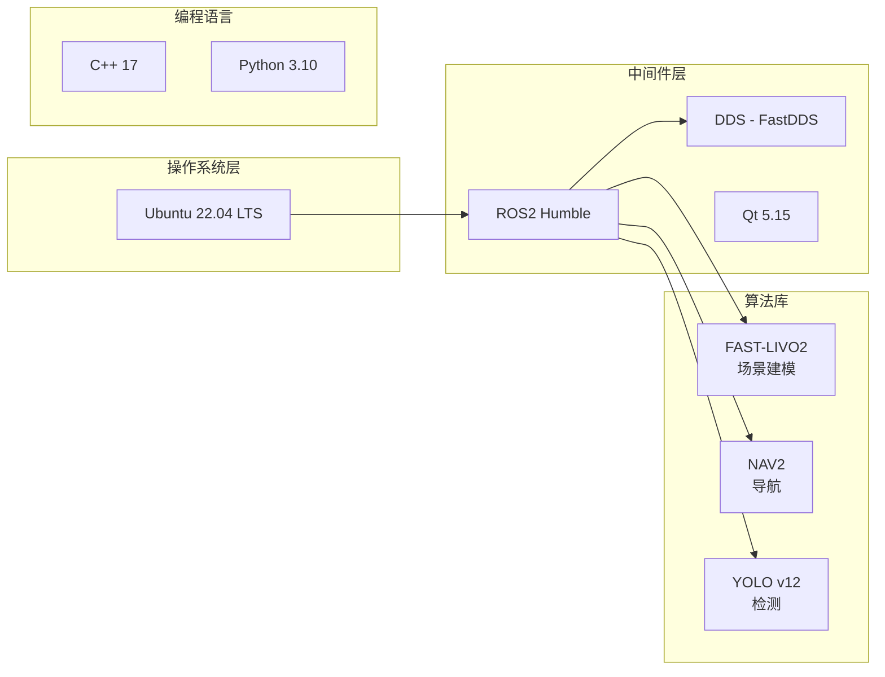

---

## 2. 软件架构

### 2.1 工控机软件架构

#### 2.1.1 模块划分

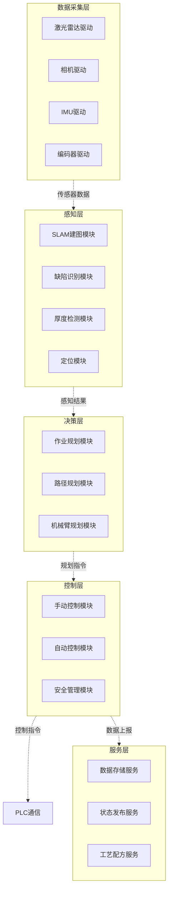

#### 2.1.2 ROS2 节点架构

**命名空间策略**：为避免多设备在同一DDS网络中的节点和Topic冲突，采用命名空间隔离：
- 侧墙平台：`/sidewall`
- 底板平台：`/floor`
- 环氧砂浆设备：`/epoxy`

**核心节点列表**（以侧墙平台为例，底板平台同理）：

| 节点名称 | 完整路径 | 功能 | 订阅Topic | 发布Topic |
|----------|----------|------|-----------|-----------|
| lidar_driver_node | /sidewall/lidar_driver_node | 底盘导航雷达数据采集 | - | /sidewall/scan |
| camera_driver_node | /sidewall/camera_driver_node | 缺陷检测相机数据采集 | - | /sidewall/camera/image_raw |
| slam_node | /sidewall/slam_node | 场景建模（FAST-LIVO2） | /sidewall/fastlivo/scan<br/>/sidewall/fastlivo/imu<br/>/sidewall/fastlivo/image | /sidewall/map<br/>/sidewall/pose |
| defect_detection_node | /sidewall/defect_detection_node | 缺陷检测 | /sidewall/camera/image_raw | /sidewall/defects |
| navigation_node | /sidewall/navigation_node | 自主导航规划 | /sidewall/map<br/>/sidewall/pose | /sidewall/cmd_vel |
| control_node | /sidewall/control_node | 运动控制 | /sidewall/cmd_vel<br/>/sidewall/robot_cmd | /sidewall/plc/command |
| plc_bridge_node | /sidewall/plc_bridge_node | PLC通信桥接 | /sidewall/plc/command | /sidewall/plc/status |
| state_publisher_node | /sidewall/state_publisher_node | 状态发布与心跳 | /sidewall/plc/status | /sidewall/robot_state<br/>/sidewall/heartbeat |
| safety_monitor_node | /sidewall/safety_monitor_node | 安全监控 | /sidewall/emergency_stop<br/>/emergency_stop_all | - |

**环氧砂浆设备节点列表**（精简版，无智能功能）：

| 节点名称 | 完整路径 | 功能 | 订阅Topic | 发布Topic |
|----------|----------|------|-----------|-----------|
| control_node | /epoxy/control_node | 手动控制 | /epoxy/robot_cmd | /epoxy/plc/command |
| plc_bridge_node | /epoxy/plc_bridge_node | PLC通信桥接 | /epoxy/plc/command | /epoxy/plc/status |
| state_publisher_node | /epoxy/state_publisher_node | 状态发布与心跳 | /epoxy/plc/status | /epoxy/robot_state<br/>/epoxy/heartbeat |
| safety_monitor_node | /epoxy/safety_monitor_node | 安全监控 | /epoxy/emergency_stop<br/>/emergency_stop_all | - |
| sensor_publisher_node | /epoxy/sensor_publisher_node | 传感器数据上报 | /epoxy/plc/sensor_data | /epoxy/sensors/thickness<br/>/epoxy/sensors/pressure |

**全局共享Topic**（真正的全局命名空间，必须带斜杠前缀）：

| Topic名称 | 用途 | 发布者 | 订阅者 | 说明 |
|-----------|------|--------|--------|------|
| /emergency_stop_all | 系统级紧急停止所有设备 | 管理平台 | 所有设备工控机 | 极端情况使用 |
| /time_sync | 时间同步 | 管理平台（可选） | 所有设备 | 可选功能 |

**设计原则**：
- ✅ **设备独立性**：急停（`/sidewall/emergency_stop`）和心跳（`/sidewall/heartbeat`）使用各自命名空间，设备可独立启动工作
- ✅ **架构统一性**：所有设备（包括环氧砂浆）都采用ROS2架构，便于管理和扩展
- ✅ **功能分层**：
  - 智能平台（侧墙、底板）：完整功能（导航+检测+控制）
  - 简化设备（环氧砂浆）：基础功能（手动控制+传感器上报）
- ✅ **命名清晰**：
  - 全局Topic：以 `/` 开头（如 `/emergency_stop_all`），不受命名空间影响
  - 设备Topic：以 `/` 开头+设备ID（如 `/sidewall/xxx`），或在命名空间内使用相对名称
- ✅ **最小依赖**：设备不依赖管理平台即可启动和运行，管理平台仅用于监控和协调
- ✅ **分级控制**：单设备急停用 `/sidewall/emergency_stop`，系统级急停用 `/emergency_stop_all`

**ROS2命名规则说明**：
- 相对名称（无前缀斜杠）：如 `cmd_vel` 在命名空间 `/sidewall` 下会变成 `/sidewall/cmd_vel`
- 全局名称（带前缀斜杠）：如 `/emergency_stop_all` 无论在哪个命名空间都是 `/emergency_stop_all`

**节点启动示例**（launch file，展示配置化差异）：
```python
# robot.launch.py - 统一的启动文件
from launch import LaunchDescription
from launch.actions import DeclareLaunchArgument, IncludeLaunchDescription
from launch.conditions import IfCondition
from launch.substitutions import LaunchConfiguration
from launch_ros.actions import Node

def generate_launch_description():
    # 声明参数
    robot_type_arg = DeclareLaunchArgument(
        'robot_type',
        default_value='sidewall',
        description='Robot type: sidewall, floor, or epoxy'
    )
    
    robot_id_arg = DeclareLaunchArgument(
        'robot_id',
        default_value='sidewall',
        description='Robot namespace'
    )
    
    # 获取参数值
    robot_type = LaunchConfiguration('robot_type')
    robot_id = LaunchConfiguration('robot_id')
    
    return LaunchDescription([
        robot_type_arg,
        robot_id_arg,
        
        # 基础节点 - 所有设备都启动
        Node(
            package='control',
            executable='control_node',
            name='control_node',
            namespace=robot_id,
            parameters=[{'robot_type': robot_type}]
        ),
        Node(
            package='plc_bridge',
            executable='plc_bridge_node',
            name='plc_bridge_node',
            namespace=robot_id,
            parameters=[{'robot_type': robot_type}]
        ),
        Node(
            package='safety',
            executable='safety_monitor_node',
            name='safety_monitor_node',
            namespace=robot_id,
            remappings=[
                ('emergency_stop', 'emergency_stop'),
                ('emergency_stop_all', '/emergency_stop_all'),
            ]
        ),
        
        # 智能节点 - 仅在robot_type为sidewall或floor时启动
        Node(
            package='lidar_driver',
            executable='lidar_driver_node',
            name='lidar_driver_node',
            namespace=robot_id,
            condition=IfCondition("'$(var robot_type)' != 'epoxy'"),
            parameters=[{'robot_id': robot_id}]
        ),
        Node(
            package='navigation',
            executable='navigation_node',
            name='navigation_node',
            namespace=robot_id,
            condition=IfCondition("'$(var robot_type)' != 'epoxy'"),
            remappings=[
                ('cmd_vel', '/$(var robot_id)/cmd_vel'),
                ('scan', '/$(var robot_id)/scan'),
            ]
        ),
        Node(
            package='slam',
            executable='slam_node',
            name='slam_node',
            namespace=robot_id,
            condition=IfCondition("'$(var robot_type)' != 'epoxy'")
        ),
        Node(
            package='defect_detection',
            executable='defect_detection_node',
            name='defect_detection_node',
            namespace=robot_id,
            condition=IfCondition("'$(var robot_type)' != 'epoxy'")
        ),
        
        # 传感器节点 - 仅在robot_type为epoxy时启动
        Node(
            package='sensor_publisher',
            executable='sensor_publisher_node',
            name='sensor_publisher_node',
            namespace=robot_id,
            condition=IfCondition("'$(var robot_type)' == 'epoxy'")
        ),
    ])

# 使用示例：
# 启动侧墙平台（完整功能）：
#   ros2 launch robot_control robot.launch.py robot_type:=sidewall robot_id:=sidewall
#
# 启动环氧砂浆设备（精简功能）：
#   ros2 launch robot_control robot.launch.py robot_type:=epoxy robot_id:=epoxy
```

---

### 2.2 控制系统软件架构

#### 2.2.1 界面架构

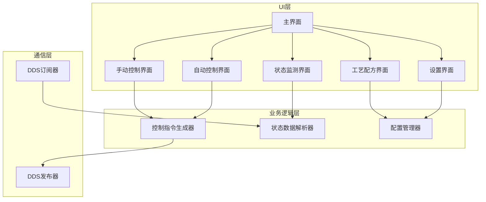

#### 2.2.2 控制流程

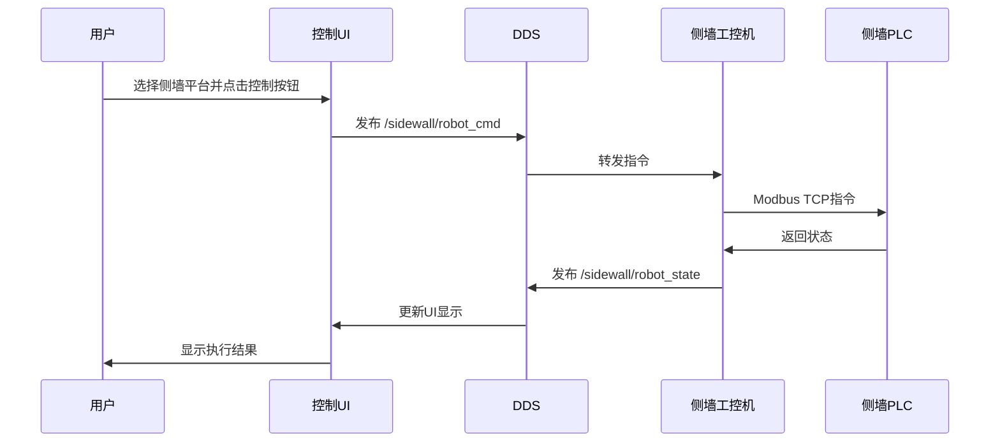

**说明**：
- 底板平台使用 `/floor/*` 命名空间，流程相同
- 单设备急停发布到 `/sidewall/emergency_stop`，仅影响该设备
- 系统级急停发布到 `/emergency_stop_all`（带前缀斜杠），影响所有设备

---

### 2.3 远程可视化管理平台架构

#### 2.3.1 功能模块

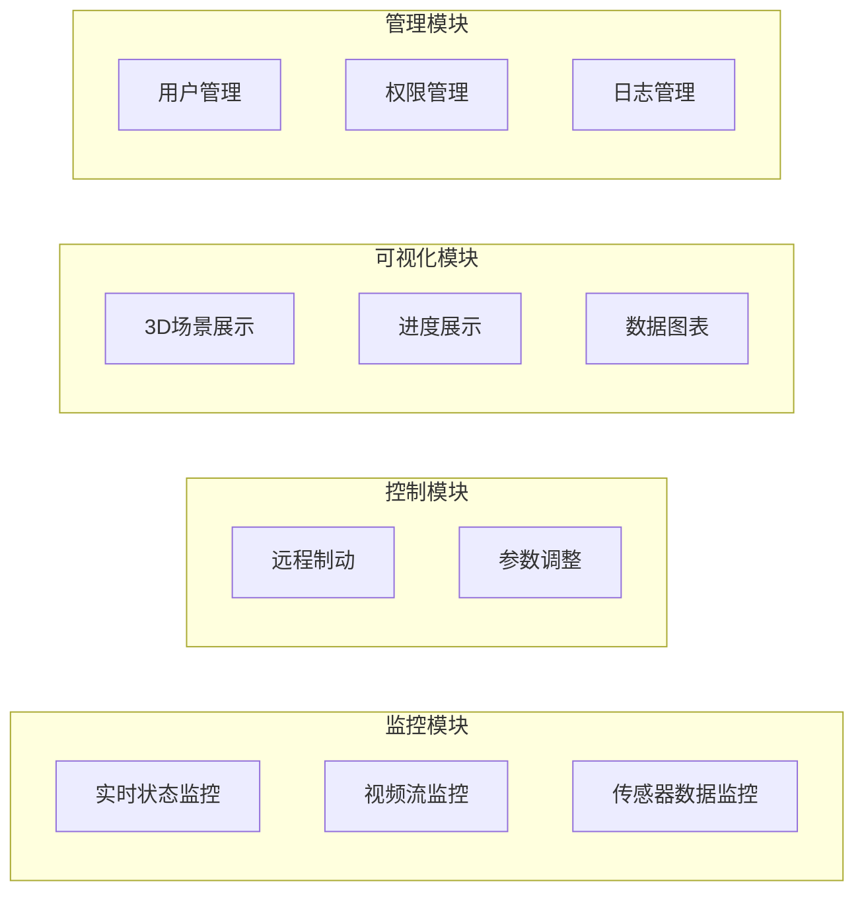

---

## 3. 通信架构

### 3.1 DDS通信机制

#### 3.1.1 Topic设计

**设备专用Topic**（带命名空间，以侧墙平台为例）：

| Topic名称 | 数据类型 | QoS | 发布者 | 订阅者 | 频率 |
|-----------|----------|-----|--------|--------|------|
| /sidewall/robot_state | RobotState | Reliable | 工控机 | 控制系统、管理平台 | 10Hz |
| /sidewall/robot_cmd | RobotCommand | Reliable | 控制系统 | 工控机 | 事件触发 |
| /sidewall/emergency_stop | EmergencyStop | Reliable | 控制系统、管理平台 | 工控机 | 事件触发 |
| /sidewall/heartbeat | Heartbeat | Reliable | 工控机 | 控制系统、管理平台 | 1Hz |
| /sidewall/camera/image | Image | BestEffort | 工控机 | 管理平台 | 5Hz |
| /sidewall/scan | LaserScan | Reliable | 工控机 | 导航节点 | 10Hz |
| /sidewall/defects | DefectArray | Reliable | 缺陷检测节点 | 管理平台 | 1Hz |
| /sidewall/progress | Progress | Reliable | 工控机 | 控制系统、管理平台 | 1Hz |

**全局共享Topic**（真正的全局，必须带斜杠前缀）：

| Topic名称 | 数据类型 | QoS | 发布者 | 订阅者 | 频率 | 用途 |
|-----------|----------|-----|--------|--------|------|------|
| /emergency_stop_all | EmergencyStopAll | Reliable | 管理平台 | 所有工控机 | 事件触发 | 系统级紧急停止 |
| /time_sync | TimeSync | BestEffort | 管理平台（可选） | 所有设备 | 10Hz | 时间同步（可选） |

**命名规则**：
- **设备专用**：`/<robot_id>/<topic_name>` （推荐，大部分Topic）
- **全局共享**：`/<topic_name>` （带前缀斜杠，极少使用）
- **robot_id枚举**：`sidewall`（侧墙）、`floor`（底板）、`epoxy`（环氧砂浆）

**设计原则**：
- 设备应该能够**独立启动和工作**，不依赖管理平台
- 急停、心跳等关键功能使用设备自己的命名空间
- 全局Topic仅用于真正需要广播的场景（如系统级紧急停止所有设备）

**ROS2命名解析规则**：
```python
# 在命名空间 /sidewall 下的节点
Node(namespace='sidewall')

# 相对名称（会加上命名空间）
'cmd_vel'  →  '/sidewall/cmd_vel'

# 全局名称（不受命名空间影响）
'/emergency_stop_all'  →  '/emergency_stop_all'
```

#### 3.1.2 QoS配置

```yaml
# 控制指令 - 高可靠性
control_qos:
  reliability: RELIABLE
  durability: TRANSIENT_LOCAL
  deadline: 100ms
  lifespan: 1s

# 传感器数据 - 高吞吐量
sensor_qos:
  reliability: BEST_EFFORT
  durability: VOLATILE
  deadline: 200ms

# 状态数据 - 可靠性优先
state_qos:
  reliability: RELIABLE
  durability: TRANSIENT_LOCAL
  history: KEEP_LAST
  depth: 10
```

#### 3.1.3 DDS域隔离方案（备选）

除了命名空间方案，还可以使用DDS Domain ID进行网络隔离：

| 设备 | Domain ID | 适用场景 |
|------|-----------|----------|
| 所有设备（默认） | 0 | 推荐：同一域便于跨设备通信 |
| 侧墙平台 | 1 | 备选：完全隔离场景 |
| 底板平台 | 2 | 备选：完全隔离场景 |
| 环氧砂浆设备 | 3 | 备选：完全隔离场景 |
| 管理平台 | 0（监听1,2,3） | 需要DDS桥接多域 |

**推荐方案**：采用**命名空间方案**（Domain ID = 0），理由：
- 简化配置，所有设备在同一DDS域
- 便于系统级消息广播（如 `emergency_stop_all`）
- 管理平台可直接订阅所有设备Topic
- 设备可独立启动，不依赖管理平台
- 避免Domain ID桥接的复杂性

### 3.2 组网方案

#### 3.2.1 WIFI6方案（推荐）

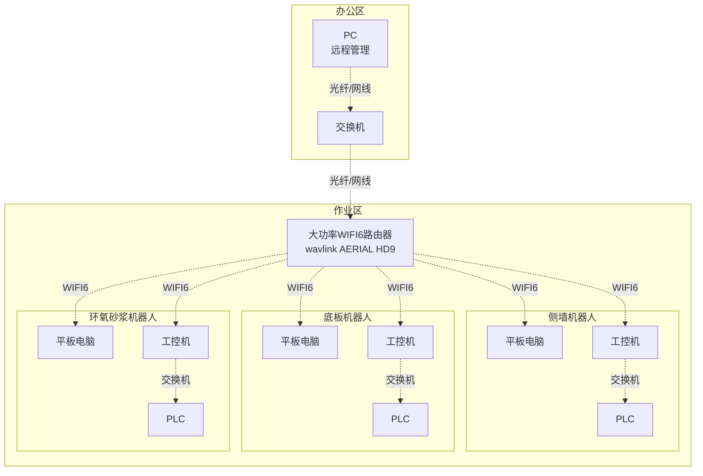

**覆盖范围**: 
- 单路由器: ~500m
- Mesh拓展: 最远可达3km

**带宽分配**:
- 总带宽: 1800Mbps (WIFI6)
- 控制指令: 优先级最高（<1Mbps）
- 传感器数据: 中优先级（~100Mbps/机器人）
- 视频流: 低优先级（~50Mbps/机器人）

**DDS网络配置**:
- 所有设备使用 Domain ID = 0
- 通过命名空间区分设备：`/sidewall`, `/floor`, `/epoxy`
- 设备独立Topic：`/sidewall/emergency_stop`, `/sidewall/heartbeat`
- 全局Topic（带前缀斜杠）：`/emergency_stop_all`, `/time_sync`（极少使用）

#### 3.2.2 4G/5G备用方案

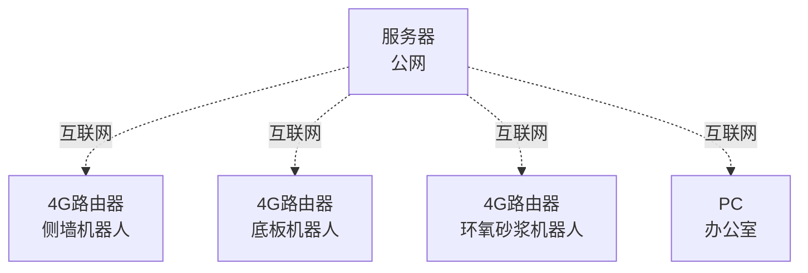

**适用场景**: WIFI6信号不稳定时自动切换

---

## 4. 数据架构

### 4.1 数据流图

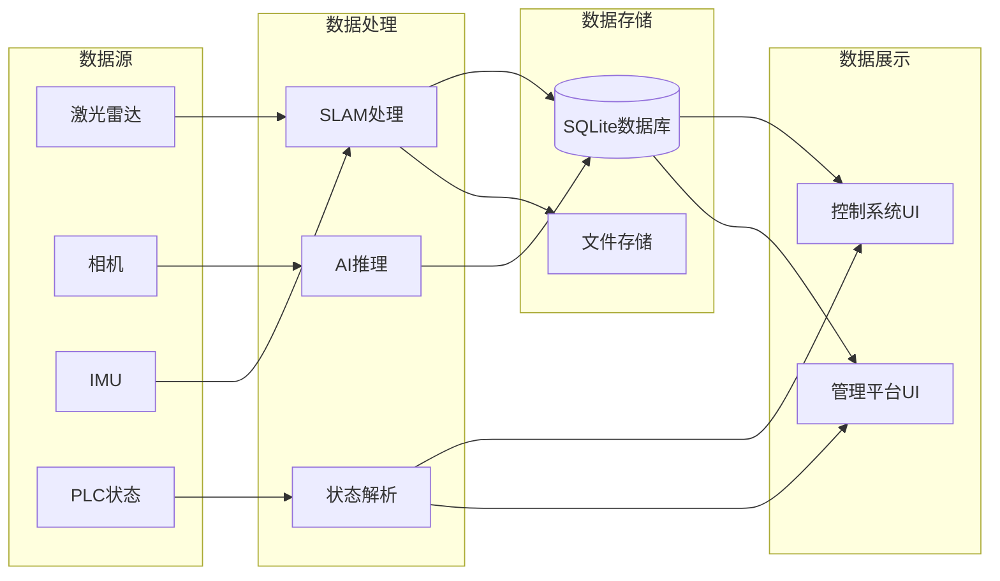

### 4.2 数据库设计

#### 4.2.1 数据表结构

**作业记录表 (task_record)**
```sql
CREATE TABLE task_record (
    id INTEGER PRIMARY KEY AUTOINCREMENT,
    robot_id TEXT NOT NULL,
    task_type TEXT NOT NULL,  -- 'inspect', 'grind', 'spray'
    start_time TIMESTAMP,
    end_time TIMESTAMP,
    status TEXT,  -- 'running', 'completed', 'failed'
    progress REAL
);
```

**缺陷记录表 (defect_record)**
```sql
CREATE TABLE defect_record (
    id INTEGER PRIMARY KEY AUTOINCREMENT,
    task_id INTEGER,
    defect_type TEXT,  -- 'crack', 'bubble', 'unevenness'
    position_x REAL,
    position_y REAL,
    position_z REAL,
    severity INTEGER,  -- 1-5
    image_path TEXT,
    detection_time TIMESTAMP,
    FOREIGN KEY(task_id) REFERENCES task_record(id)
);
```

**厚度检测表 (thickness_record)**
```sql
CREATE TABLE thickness_record (
    id INTEGER PRIMARY KEY AUTOINCREMENT,
    task_id INTEGER,
    position_x REAL,
    position_y REAL,
    thickness_before REAL,
    thickness_after REAL,
    measurement_time TIMESTAMP,
    FOREIGN KEY(task_id) REFERENCES task_record(id)
);
```

### 4.3 数据存储策略

| 数据类型 | 存储位置 | 保留时长 | 备份策略 |
|----------|----------|----------|----------|
| 传感器原始数据 | 工控机SSD | 7天 | 不备份 |
| 处理后数据（缺陷、厚度） | SQLite数据库 | 永久 | 每日备份到PC |
| 3D模型 | 工控机SSD | 永久 | 手动备份 |
| 系统日志 | 工控机SSD | 30天 | 每周备份 |
| 视频录像 | 工控机SSD | 3天 | 不备份 |

---

## 5. 关键设计

### 5.1 场景建模方案

#### 5.1.1 技术方案
- **算法**: FAST-LIVO2（激光+IMU+视觉融合）
- **部署方式**: 独立模块，ROS1环境
- **数据传输**: 通过scp传输PCD文件

#### 5.1.2 工作流程

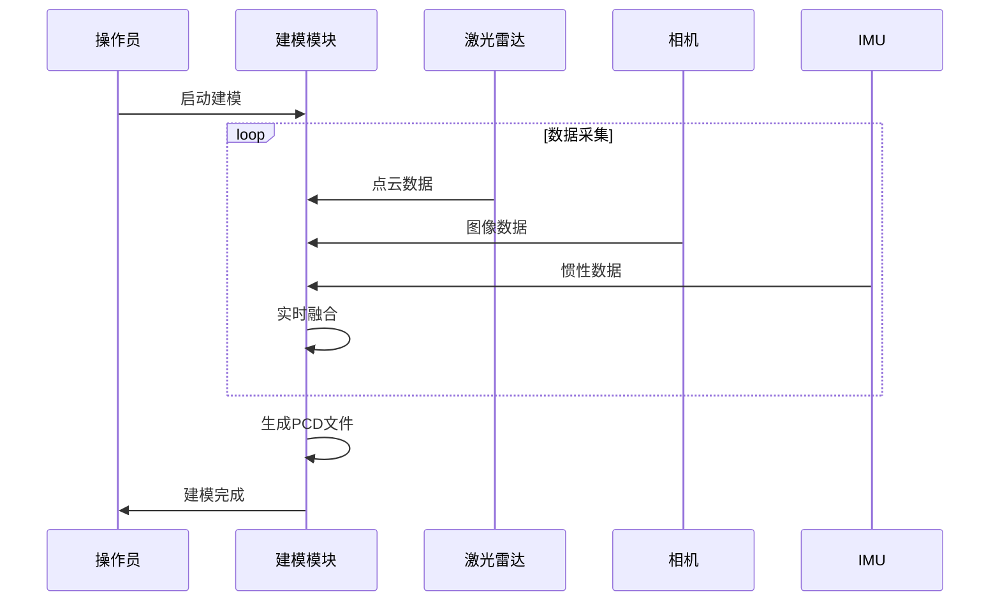

### 5.2 定位导航方案

#### 5.2.1 技术方案
- **框架**: ROS2 NAV2
- **定位**: AMCL（自适应蒙特卡洛定位）
- **规划器**: Regulated Pure Pursuit
- **控制器**: DWB (Dynamic Window Approach)

#### 5.2.2 导航流程

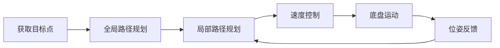

### 5.3 缺陷检测方案

#### 5.3.1 技术方案
- **算法**: YOLO v12
- **输入**: 高精度相机图像（31MP）
- **输出**: 缺陷类型、位置、置信度

#### 5.3.2 检测流程

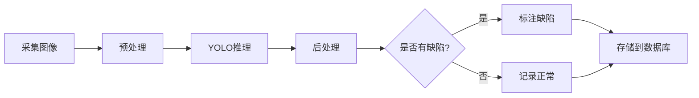

---

## 6. 部署视图

### 6.1 硬件部署

详见 [附录A_硬件选型清单](./附录/A_硬件选型清单.md)

### 6.2 软件部署

#### 6.2.1 工控机软件部署

```
工控机 (宸曜 Nuvo-10003-MH5)
├── Ubuntu 22.04 LTS
├── ROS2 Humble
│   ├── 激光雷达驱动
│   ├── 相机驱动
│   ├── NAV2导航栈
│   └── 自研节点
├── Docker容器
│   └── FAST-LIVO2 (ROS1 Noetic)
├── AI推理引擎
│   └── YOLO v12 (RTX 4060 Ti 16GB加速)
└── SQLite数据库
```

#### 6.2.2 控制系统部署

```
平板电脑 (亿道三防 MES PAD Q122J)
├── Ubuntu 22.04 LTS
├── ROS2 Humble
└── Qt应用程序
    ├── 控制UI
    └── ROS2通信库
```

---

## 7. 接口设计

详见 [04_接口设计文档](./04_接口设计文档.md)

---

## 8. 安全设计

### 8.1 功能安全

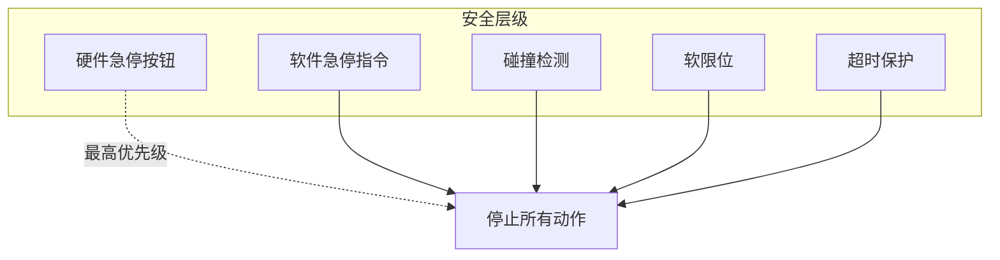

### 8.2 信息安全

- **用户认证**: 用户名+密码
- **数据加密**: DDS传输加密（TLS）
- **权限管理**: 基于角色的访问控制（RBAC）
- **审计日志**: 记录所有关键操作

---

## 9. 性能设计

### 9.1 性能指标

| 指标 | 目标值 | 测试方法 |
|------|--------|----------|
| 控制指令延迟 | <100ms | 端到端时延测试 |
| 视频流延迟 | <1s | 网络延迟测试 |
| SLAM更新频率 | 10Hz | 性能分析工具 |
| AI推理速度 | >5FPS | GPU利用率监控 |
| 数据库查询响应 | <100ms | 压力测试 |

### 9.2 性能优化策略

- **多线程处理**: ROS2 MultiThreadedExecutor
- **GPU加速**: YOLO模型TensorRT优化
- **数据压缩**: 图像JPEG压缩传输
- **缓存机制**: 频繁查询数据缓存

---

## 10. 可维护性设计

### 10.1 日志策略

```python
# 日志级别
DEBUG    # 调试信息
INFO     # 正常运行信息
WARNING  # 警告信息
ERROR    # 错误信息
CRITICAL # 严重错误

# 日志格式
[时间] [级别] [模块名] [线程ID] 消息内容
```

### 10.2 故障诊断

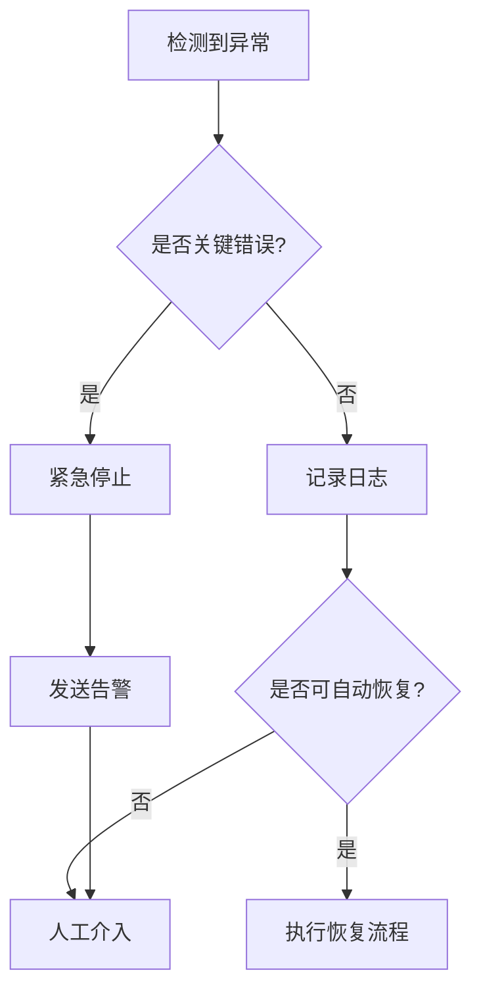

---

**下一步**: 查看 [04_接口设计文档](./04_接口设计文档.md) 了解详细接口定义
