# 系统架构设计

> 软件系统的核心设计文档

---

## 1. 架构概览

### 1.1 总体架构

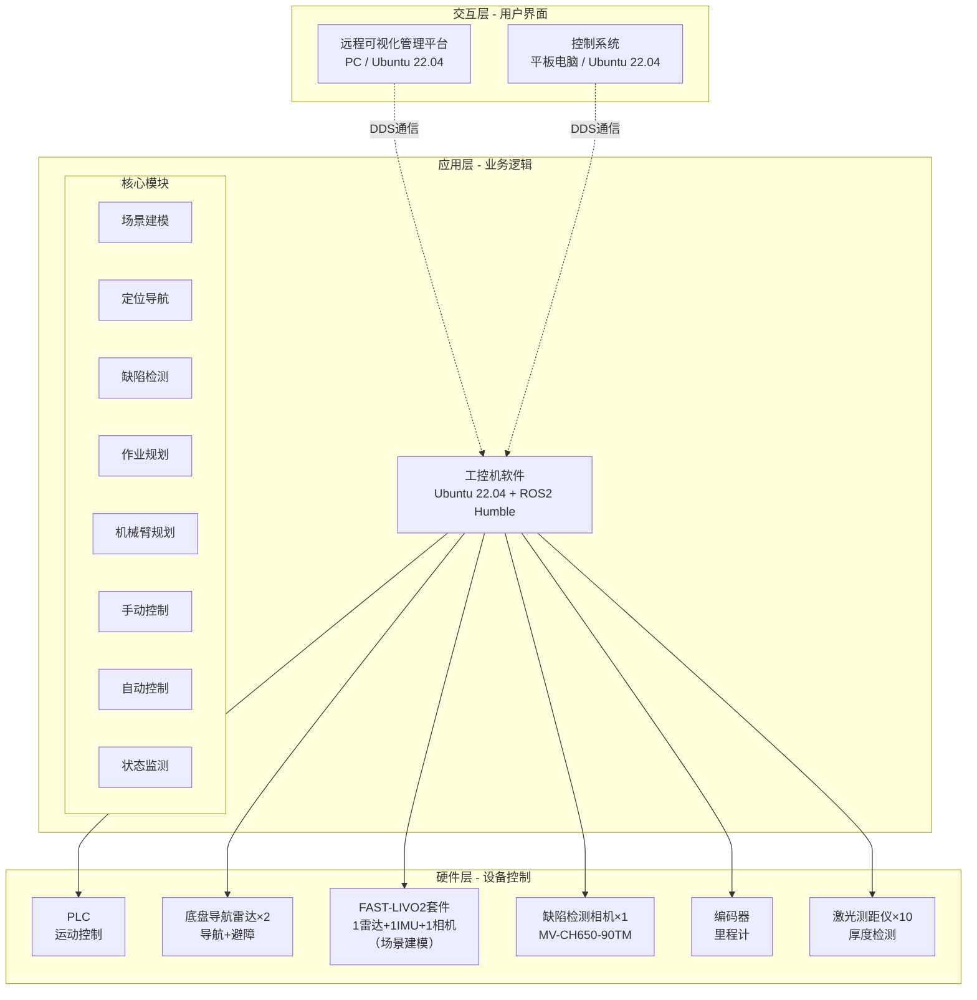

### 1.2 软件清单

| 软件名称 | 运行平台 | 开发框架 | 主要功能 | 适用设备 |
|----------|----------|----------|----------|----------|
| 远程可视化管理平台 | PC (Ubuntu 22.04) | Qt + ROS2 | 远程监控、进度可视化、远程制动 | 所有设备 |
| 控制系统 | 平板电脑 (Ubuntu 22.04) | Qt + ROS2 | 手动/自动控制、状态监测 | 所有设备 |
| 工控机软件 | 工控机 (Ubuntu 22.04) | ROS2 Humble | SLAM、AI检测、导航控制 | 侧墙、底板平台 |

**注意**：环氧砂浆设备仅需遥控操作，不需要工控机和智能功能。

### 1.3 技术栈

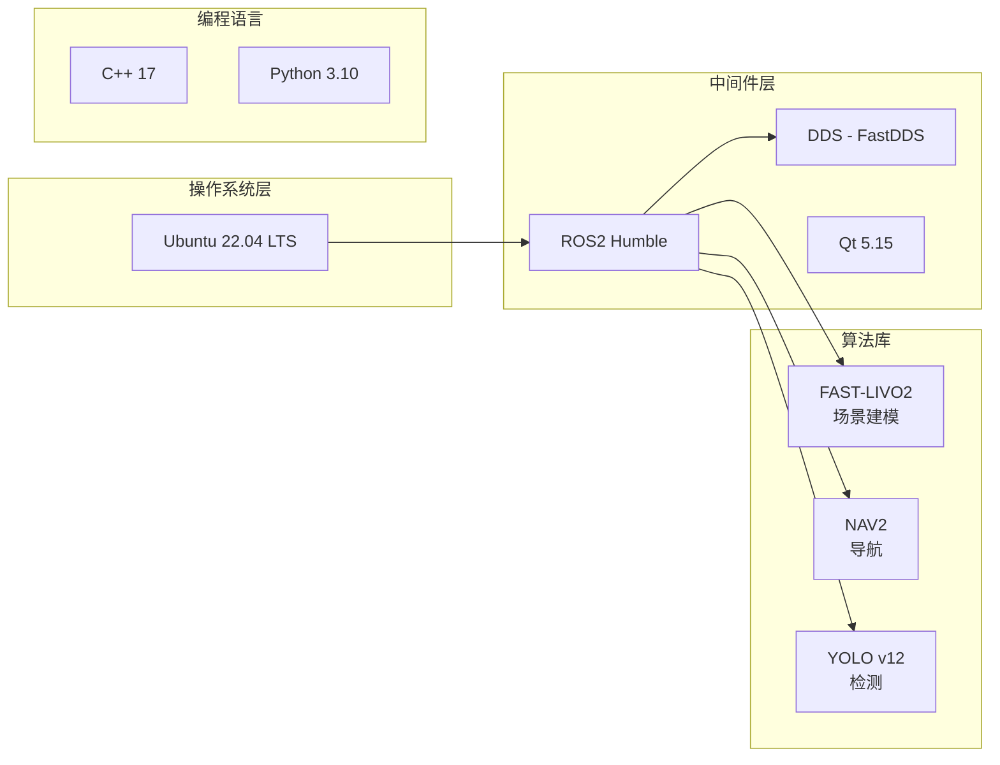

---

## 2. 软件架构

### 2.1 工控机软件架构

#### 2.1.1 模块划分

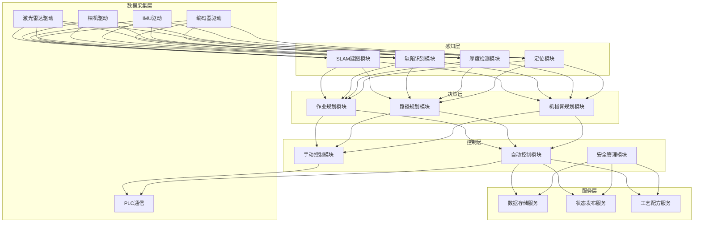

#### 2.1.2 ROS2 节点架构

| 节点名称 | 功能 | 订阅Topic | 发布Topic |
|----------|------|-----------|-----------|
| lidar_driver_node | 激光雷达数据采集 | - | /scan, /pointcloud |
| camera_driver_node | 相机数据采集 | - | /camera/image_raw |
| slam_node | SLAM建图与定位 | /scan, /imu, /odom | /map, /pose |
| defect_detection_node | 缺陷检测 | /camera/image_raw | /defects |
| navigation_node | 导航规划 | /map, /pose | /cmd_vel |
| control_node | 运动控制 | /cmd_vel, /manual_cmd | /plc/command |
| plc_bridge_node | PLC通信桥接 | /plc/command | /plc/status |

---

### 2.2 控制系统软件架构

#### 2.2.1 界面架构

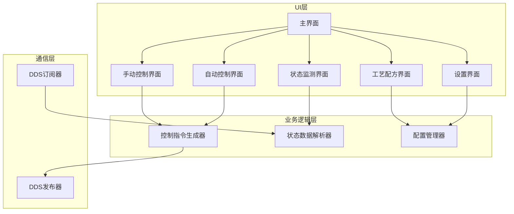

#### 2.2.2 控制流程

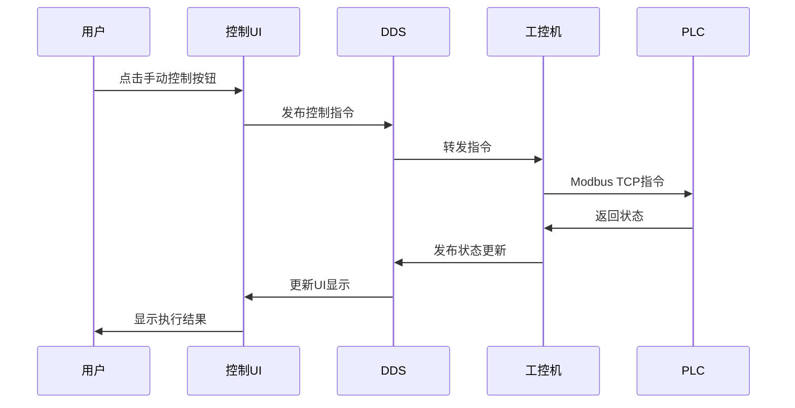

---

### 2.3 远程可视化管理平台架构

#### 2.3.1 功能模块

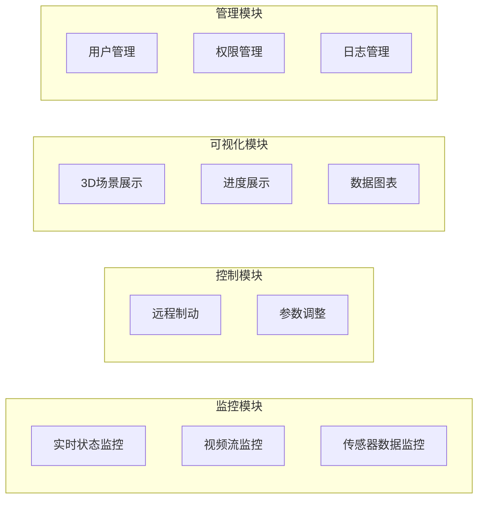

---

## 3. 通信架构

### 3.1 DDS通信机制

#### 3.1.1 Topic设计

| Topic名称 | 数据类型 | QoS | 发布者 | 订阅者 | 频率 |
|-----------|----------|-----|--------|--------|------|
| /robot/state | RobotState | Reliable | 工控机 | 控制系统、管理平台 | 10Hz |
| /robot/cmd | RobotCommand | Reliable | 控制系统 | 工控机 | 事件触发 |
| /robot/emergency_stop | EmergencyStop | Reliable | 控制系统、管理平台 | 工控机 | 事件触发 |
| /sensor/camera/image | Image | BestEffort | 工控机 | 管理平台 | 5Hz |
| /sensor/lidar/scan | LaserScan | Reliable | 工控机 | SLAM节点 | 10Hz |
| /defects | DefectArray | Reliable | 缺陷检测节点 | 管理平台 | 1Hz |
| /progress | Progress | Reliable | 工控机 | 控制系统、管理平台 | 1Hz |

#### 3.1.2 QoS配置

```yaml
# 控制指令 - 高可靠性
control_qos:
  reliability: RELIABLE
  durability: TRANSIENT_LOCAL
  deadline: 100ms
  lifespan: 1s

# 传感器数据 - 高吞吐量
sensor_qos:
  reliability: BEST_EFFORT
  durability: VOLATILE
  deadline: 200ms

# 状态数据 - 可靠性优先
state_qos:
  reliability: RELIABLE
  durability: TRANSIENT_LOCAL
  history: KEEP_LAST
  depth: 10
```

### 3.2 组网方案

#### 3.2.1 WIFI6方案（推荐）

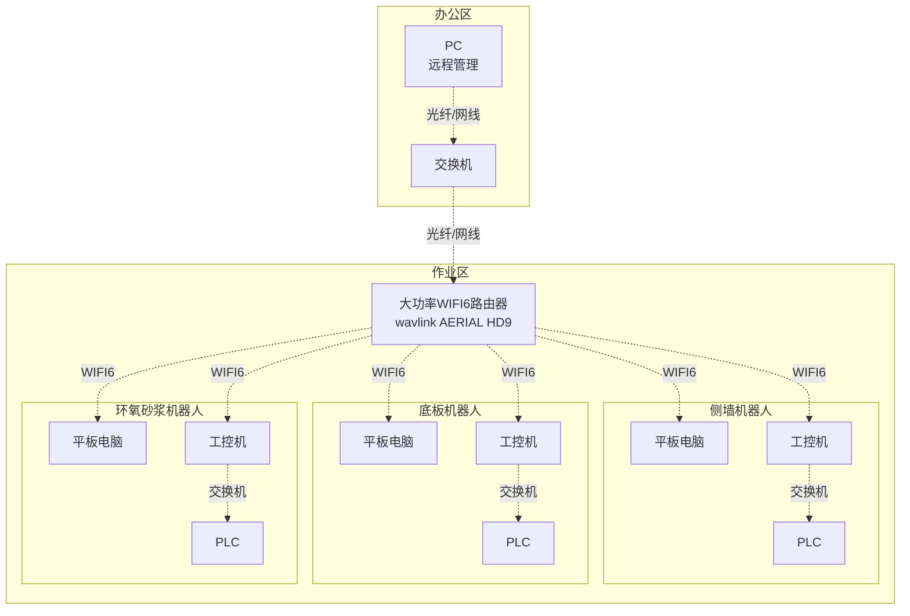

**覆盖范围**: 
- 单路由器: ~500m
- Mesh拓展: 最远可达3km

**带宽分配**:
- 总带宽: 1800Mbps (WIFI6)
- 控制指令: 优先级最高（<1Mbps）
- 传感器数据: 中优先级（~100Mbps/机器人）
- 视频流: 低优先级（~50Mbps/机器人）

#### 3.2.2 4G/5G备用方案

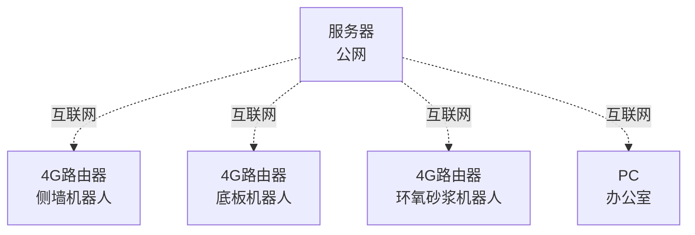

**适用场景**: WIFI6信号不稳定时自动切换

---

## 4. 数据架构

### 4.1 数据流图

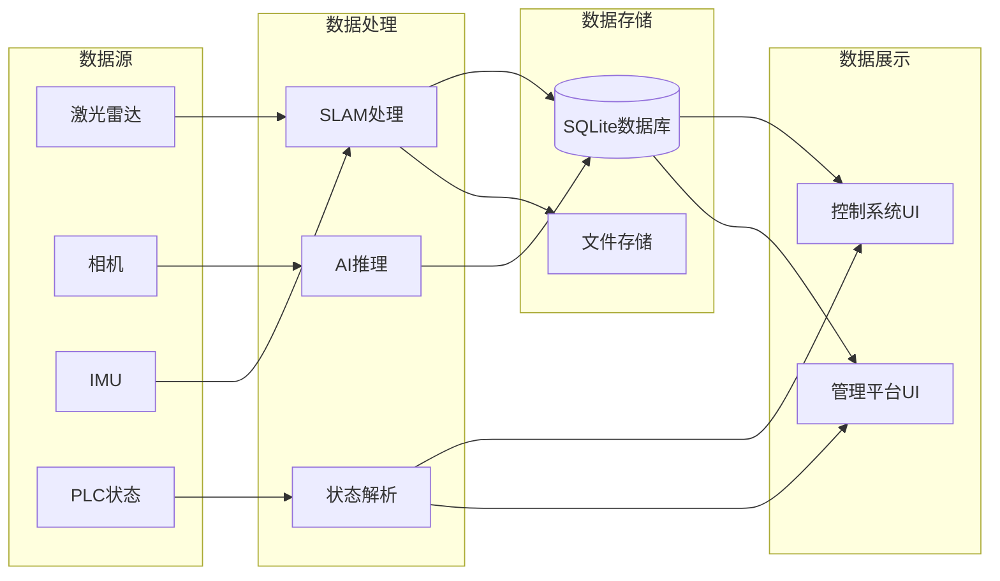

### 4.2 数据库设计

#### 4.2.1 数据表结构

**作业记录表 (task_record)**
```sql
CREATE TABLE task_record (
    id INTEGER PRIMARY KEY AUTOINCREMENT,
    robot_id TEXT NOT NULL,
    task_type TEXT NOT NULL,  -- 'inspect', 'grind', 'spray'
    start_time TIMESTAMP,
    end_time TIMESTAMP,
    status TEXT,  -- 'running', 'completed', 'failed'
    progress REAL
);
```

**缺陷记录表 (defect_record)**
```sql
CREATE TABLE defect_record (
    id INTEGER PRIMARY KEY AUTOINCREMENT,
    task_id INTEGER,
    defect_type TEXT,  -- 'crack', 'bubble', 'unevenness'
    position_x REAL,
    position_y REAL,
    position_z REAL,
    severity INTEGER,  -- 1-5
    image_path TEXT,
    detection_time TIMESTAMP,
    FOREIGN KEY(task_id) REFERENCES task_record(id)
);
```

**厚度检测表 (thickness_record)**
```sql
CREATE TABLE thickness_record (
    id INTEGER PRIMARY KEY AUTOINCREMENT,
    task_id INTEGER,
    position_x REAL,
    position_y REAL,
    thickness_before REAL,
    thickness_after REAL,
    measurement_time TIMESTAMP,
    FOREIGN KEY(task_id) REFERENCES task_record(id)
);
```

### 4.3 数据存储策略

| 数据类型 | 存储位置 | 保留时长 | 备份策略 |
|----------|----------|----------|----------|
| 传感器原始数据 | 工控机SSD | 7天 | 不备份 |
| 处理后数据（缺陷、厚度） | SQLite数据库 | 永久 | 每日备份到PC |
| 3D模型 | 工控机SSD | 永久 | 手动备份 |
| 系统日志 | 工控机SSD | 30天 | 每周备份 |
| 视频录像 | 工控机SSD | 3天 | 不备份 |

---

## 5. 关键设计

### 5.1 场景建模方案

#### 5.1.1 技术方案
- **算法**: FAST-LIVO2（激光+IMU+视觉融合）
- **部署方式**: 独立模块，ROS1环境
- **数据传输**: 通过scp传输PCD文件

#### 5.1.2 工作流程

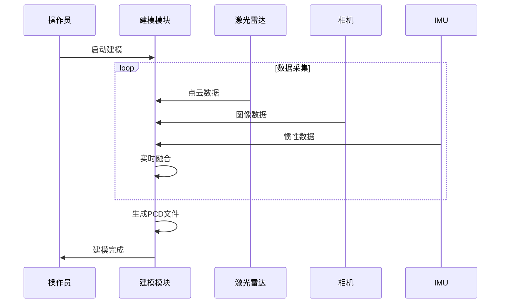

### 5.2 定位导航方案

#### 5.2.1 技术方案
- **框架**: ROS2 NAV2
- **定位**: AMCL（自适应蒙特卡洛定位）
- **规划器**: Regulated Pure Pursuit
- **控制器**: DWB (Dynamic Window Approach)

#### 5.2.2 导航流程

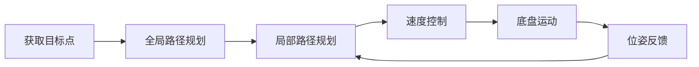

### 5.3 缺陷检测方案

#### 5.3.1 技术方案
- **算法**: YOLO v12
- **输入**: 高精度相机图像（31MP）
- **输出**: 缺陷类型、位置、置信度

#### 5.3.2 检测流程

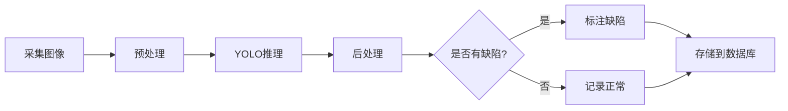

---

## 6. 部署视图

### 6.1 硬件部署

详见 [附录A_硬件选型清单](./附录/A_硬件选型清单.md)

### 6.2 软件部署

#### 6.2.1 工控机软件部署

```
工控机 (宸曜 Nuvo-10003-MH5)
├── Ubuntu 22.04 LTS
├── ROS2 Humble
│   ├── 激光雷达驱动
│   ├── 相机驱动
│   ├── NAV2导航栈
│   └── 自研节点
├── Docker容器
│   └── FAST-LIVO2 (ROS1 Noetic)
├── AI推理引擎
│   └── YOLO v12 (RTX 4060 Ti 16GB加速)
└── SQLite数据库
```

#### 6.2.2 控制系统部署

```
平板电脑 (亿道三防 MES PAD Q122J)
├── Ubuntu 22.04 LTS
├── ROS2 Humble
└── Qt应用程序
    ├── 控制UI
    └── ROS2通信库
```

---

## 7. 接口设计

详见 [04_接口设计文档](./04_接口设计文档.md)

---

## 8. 安全设计

### 8.1 功能安全

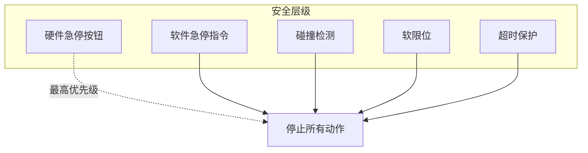

### 8.2 信息安全

- **用户认证**: 用户名+密码
- **数据加密**: DDS传输加密（TLS）
- **权限管理**: 基于角色的访问控制（RBAC）
- **审计日志**: 记录所有关键操作

---

## 9. 性能设计

### 9.1 性能指标

| 指标 | 目标值 | 测试方法 |
|------|--------|----------|
| 控制指令延迟 | <100ms | 端到端时延测试 |
| 视频流延迟 | <1s | 网络延迟测试 |
| SLAM更新频率 | 10Hz | 性能分析工具 |
| AI推理速度 | >5FPS | GPU利用率监控 |
| 数据库查询响应 | <100ms | 压力测试 |

### 9.2 性能优化策略

- **多线程处理**: ROS2 MultiThreadedExecutor
- **GPU加速**: YOLO模型TensorRT优化
- **数据压缩**: 图像JPEG压缩传输
- **缓存机制**: 频繁查询数据缓存

---

## 10. 可维护性设计

### 10.1 日志策略

```python
# 日志级别
DEBUG    # 调试信息
INFO     # 正常运行信息
WARNING  # 警告信息
ERROR    # 错误信息
CRITICAL # 严重错误

# 日志格式
[时间] [级别] [模块名] [线程ID] 消息内容
```

### 10.2 故障诊断

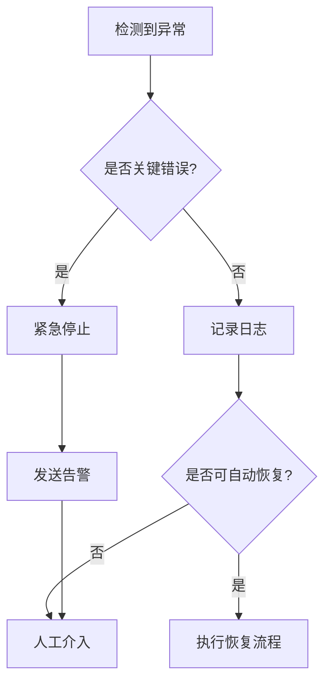

---

**下一步**: 查看 [04_接口设计文档](./04_接口设计文档.md) 了解详细接口定义
