# 系统架构设计

> 软件系统的核心设计文档

---

## 关联文档

本文档聚焦于宏观架构设计，详细的实现细节请参考：

- **[04_详细设计文档](04_详细设计文档.md)**：硬件接口层、控制器配置、应用层节点、Launch文件的详细实现
- **[05_接口设计文档](05_接口设计文档.md)**：ROS2消息/服务/动作定义、Modbus协议规范、HTTP API、数据库接口

---

## 1. 架构概览

### 1.1 总体架构

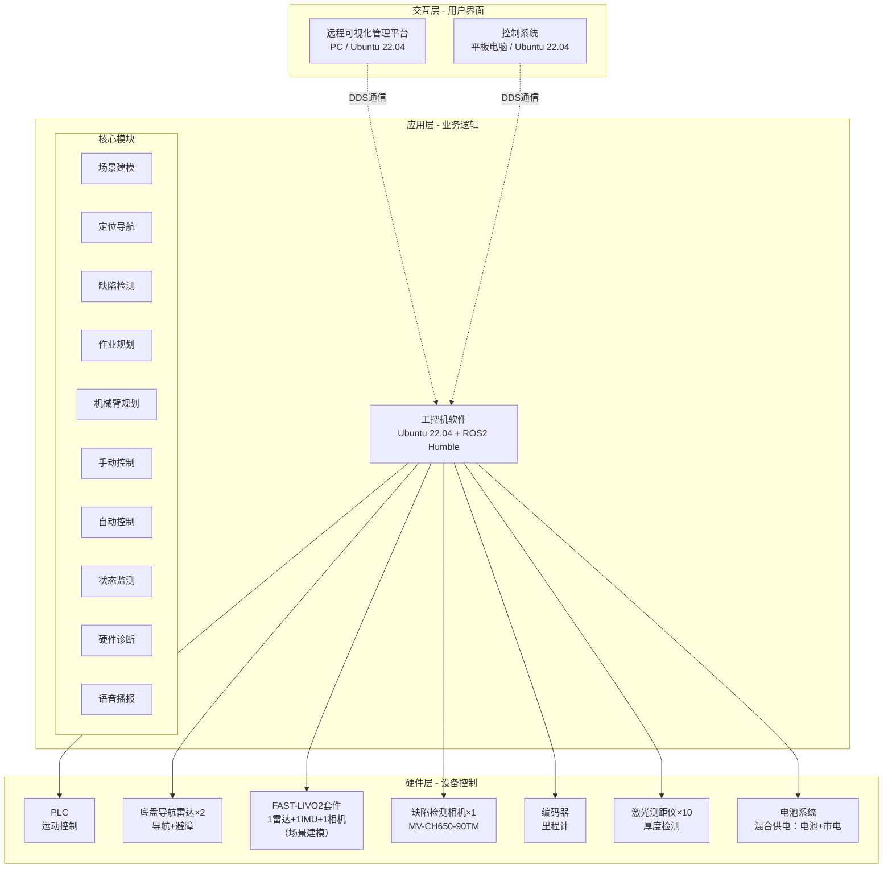

### 1.2 软件清单

| 软件名称 | 运行平台 | 开发框架 | 主要功能 | 适用设备 |
|----------|----------|----------|----------|----------|
| 远程可视化管理平台 | PC (Ubuntu 22.04) | Qt + ROS2 | 远程监控、进度可视化、远程制动 | 所有设备 |
| 控制系统 | 平板电脑 (Ubuntu 22.04) | Qt + ROS2 | 手动/自动控制、状态监测 | 所有设备 |
| 工控机软件 | 工控机 (Ubuntu 22.04) | ROS2 Humble | SLAM、AI检测、导航、手动控制、传感器上报 | 所有设备 |

**说明**：
- 所有设备均采用ROS2架构，保证架构统一性和可扩展性
- 对于工控机软件，三个设备使用**同一套软件代码**，通过launch配置文件和参数实现功能差异化：
  - **智能平台配置**（侧墙、底板）：启动全部节点（导航+检测+控制）
  - **简化平台配置**（环氧砂浆）：仅启动基础节点（手动控制+传感器上报+安全监控）
- 对于控制系统，三个设备也使用**同一套软件代码**，通过配置实现功能差异化
- 功能开关通过`robot_type`参数控制，避免维护多套代码

### 1.3 技术栈

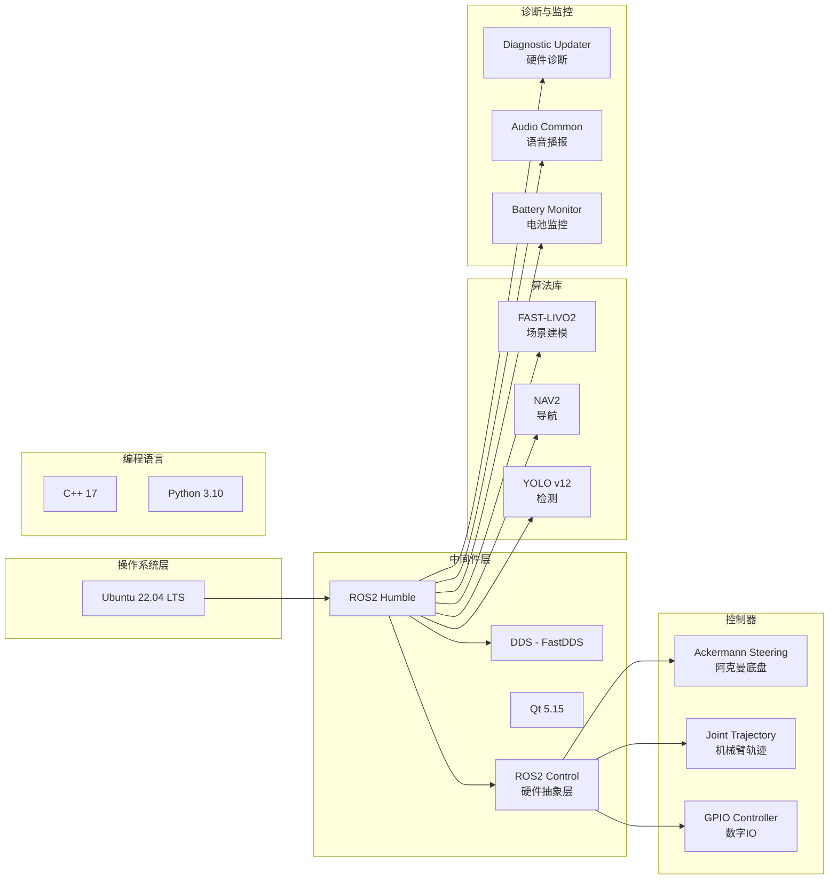

**核心技术组件**：

| 组件 | 版本 | 用途 | 说明 |
|------|------|------|------|
| **操作系统** |
| Ubuntu | 22.04 LTS | 操作系统 | LTS支持至2027年 |
| **中间件** |
| ROS2 | Humble | 机器人框架 | LTS版本，支持至2027-05 |
| DDS | FastDDS | 通信中间件 | ROS2默认DDS实现 |
| ROS2 Control | 2.x | 硬件抽象层 | 标准化硬件接口 |
| Qt | 5.15 | 图形界面框架 | 控制系统和管理平台UI |
| **算法库** |
| FAST-LIVO2 | - | 场景建模 | 激光+IMU+相机融合SLAM |
| NAV2 | Humble | 导航框架 | 路径规划、定位、避障 |
| YOLO | v12 | 目标检测 | 缺陷检测算法 |
| **控制器** |
| ackermann_steering_controller | - | 底盘控制 | 阿克曼转向控制器 |
| joint_trajectory_controller | - | 机械臂控制 | 轨迹跟踪控制器 |
| gpio_controller | - | GPIO控制 | 数字IO控制（急停、传感器） |
| range_sensor_broadcaster | - | 传感器广播 | 距离传感器数据发布 |
| **诊断与监控** |
| diagnostic_updater | - | 硬件诊断 | 硬件状态监测（温度、电压、错误） |
| diagnostic_aggregator | - | 诊断聚合 | 聚合所有诊断信息 |
| audio_common | - | 语音播报 | TTS文字转语音库 |
| battery_state_broadcaster | - | 电池监控 | 电池状态广播器 |
| **通信协议** |
| Modbus TCP | - | PLC通信 | 工控机与PLC通信协议 |
| **数据存储** |
| SQLite | 3.x | ROS bag存储 | rosbag2默认后端，临时数据 |
| MySQL | 8.0 | 业务数据管理 | 作业记录、缺陷档案、厚度检测 |
| InfluxDB | 2.x（可选） | 时序数据 | 系统监控、性能指标 |
| **编程语言** |
| C++ | 17 | 核心功能 | 性能关键部分 |
| Python | 3.10 | 业务逻辑 | 算法和脚本 |

**底盘类型说明**：
- **阿克曼转向**（Ackermann Steering）：前轮转向+驱动，后轮仅驱动
- **四轮驱动**：所有轮子都有独立驱动电机
- **差速转向**：通过左右轮速差实现转向（类似汽车）
- **控制器**：**ROS 2 Controllers 中提供的 `ackermann_steering_controller` 不可用**，因为它只能适用于两个驱动轮的情形（详见[官方文档](https://control.ros.org/rolling/doc/ros2_controllers/ackermann_steering_controller/doc/userdoc.html)和[源码](https://github.com/ros-controls/ros2_controllers/blob/master/steering_controllers_library/src/steering_controllers_library.cpp#L111-L121)），不适用于我们四驱的情形（我们需要通过差速实现原地掉头），需要参考其代码自行实现

---

## 2. 软件架构

### 2.1 工控机软件架构

#### 2.1.1 模块划分

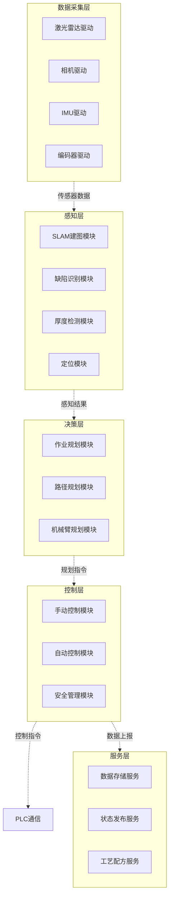

#### 2.1.2 ROS2 架构设计（基于ROS2 Control）

**命名空间策略**：为避免多设备在同一DDS网络中的节点和Topic冲突，采用命名空间隔离：
- 侧墙平台：`/sidewall`
- 底板平台：`/floor`
- 环氧砂浆设备：`/epoxy`

**架构分层**：采用ROS2 Control标准三层架构

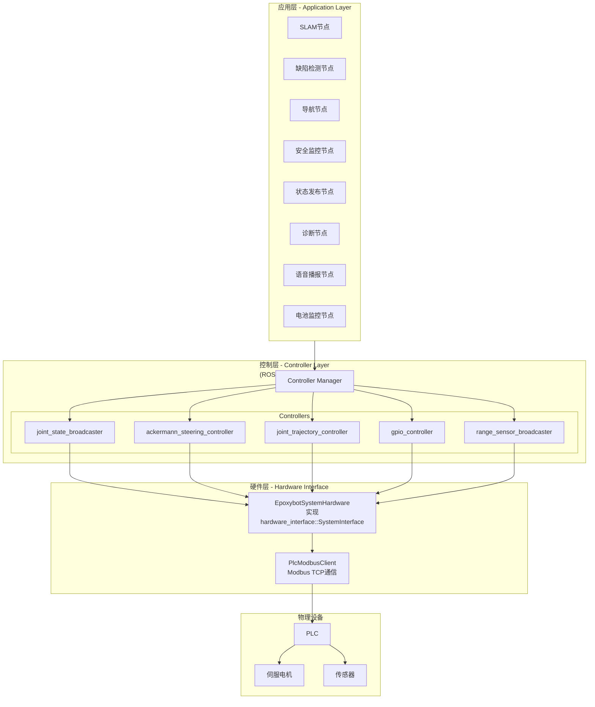

---

##### **第1层：Hardware Interface Layer（硬件接口层）**

**设计方案**：采用**统一的Hardware Interface**（`EpoxybotSystemHardware`），参考liftbot项目的设计理念。

**核心职责**：
- 实现 `hardware_interface::SystemInterface` 标准接口
- 封装PLC Modbus TCP通信（内部实现，不暴露为ROS节点）
- 管理关节状态（位置、速度、力矩）和命令缓冲区
- 管理传感器数据（距离传感器、力传感器）和GPIO状态
- 提供标准的 `read()` / `write()` 方法供controller_manager调用（50Hz）

**设备配置差异**（通过URDF定义）：

| 设备 | 底盘关节 | 机械臂关节 | 距离传感器 | 其他传感器 |
|------|----------|------------|------------|------------|
| 侧墙平台 | 5（前2驱动 + 后2驱动 + 1转向） | 7（转台+摆臂+大臂+一级伸缩臂+二级伸缩臂+末端俯仰+方位） | 10（厚度检测） | 场景建模套件（激光雷达+IMU+相机）、导航激光雷达+高精度相机+IMU |
| 底板平台 | 5（前2驱动 + 后2驱动 + 1转向） | 3（转台+伸缩+二级伸缩） | 10（厚度检测） | IMU, 高精度相机，激光雷达 |
| 环氧砂浆设备 | 5（前2驱动 + 后2驱动 + 1转向） | 2（转台+伸缩） | - | - |

**PLC通信方式**：Modbus TCP（功能码03 - 读保持寄存器）

> 详细的类设计、Modbus寄存器映射表见 **[04_详细设计文档 - 1.1节](04_详细设计文档.md#11-epoxysystemhardware-类设计)**

---

##### **第2层：Controller Layer（控制器层）**

**ROS2 Control控制器列表**：

| 控制器名称 | 类型 | 功能 | 智能平台 | 环氧砂浆 |
|-----------|------|------|----------|----------|
| **系统级控制器** |
| controller_manager | 系统节点 | 管理所有控制器，50Hz更新 | ✅ | ✅ |
| joint_state_broadcaster | Broadcaster | 发布关节状态到`/joint_states` | ✅ | ✅ |
| gpio_controller | Controller | GPIO控制（急停、LED、继电器） | ✅ | ✅ |
| **底盘控制器** |
| ackermann_steering_controller | Controller | 阿克曼底盘控制<br/>输入：`/cmd_vel`<br/>输出：前轮转向角+四轮速度 | ✅ | ❌ |
| **机械臂控制器** |
| manipulator_position_controller | Controller | 机械臂位置控制（轨迹跟踪） | ✅ | ✅ |
| manipulator_velocity_controller | Controller | 机械臂速度控制（手动操作） | ✅ | ✅ |
| **传感器广播器** |
| range_sensor_broadcaster_X | Broadcaster | 距离传感器广播（激光测距仪）<br/>发布：`/sensor_X/range` | ✅<br/>(10个) | ✅<br/>(12个) |

> 详细的控制器参数配置、Ackermann转向几何计算、轨迹插补算法见 **[04_详细设计文档 - 2节](04_详细设计文档.md#2-控制器配置详细设计)**

```yaml
    wheelbase: 1.5          # 前后轴距（m）
    front_wheel_track: 1.2  # 前轮轮距（m）
    rear_wheel_track: 1.2   # 后轮轮距（m）
    
    # 前轮（转向+驱动）
    front_steering:
      - front_left_steering_joint
      - front_right_steering_joint
    front_wheels_names:
      - front_left_wheel_joint
      - front_right_wheel_joint
    
    # 后轮（仅驱动）
    rear_wheels_names:
      - rear_left_wheel_joint
      - rear_right_wheel_joint
    
    # 速度限制
    linear:
      x: {min_velocity: -2.0, max_velocity: 2.0}
    angular:
      z: {min_velocity: -1.0, max_velocity: 1.0}
```

---

##### **第3层：Application Layer（应用层）**

**应用节点列表**（业务逻辑）：

| 节点名称 | 完整路径 | 功能 | 智能平台 | 环氧砂浆 | 订阅Topic | 发布Topic |
|----------|----------|------|----------|----------|-----------|-----------|
| **传感器驱动** |
| lidar_driver_node | /sidewall/lidar_driver_node | 底盘导航雷达驱动 | ✅ | ❌ | - | /sidewall/scan |
| camera_driver_node | /sidewall/camera_driver_node | 缺陷检测相机驱动 | ✅ | ❌ | - | /sidewall/image_raw |
| fastlivo_driver_node | /sidewall/fastlivo_driver_node | FAST-LIVO2套件驱动（一次性建模） | ✅ | ❌ | - | /sidewall/fastlivo/* |
| **感知与决策** |
| slam_node | /sidewall/slam_node | FAST-LIVO2场景建模 | ✅ | ❌ | /sidewall/fastlivo/* | /sidewall/map<br/>/sidewall/pose |
| defect_detection_node | /sidewall/defect_detection_node | YOLO缺陷检测 | ✅ | ❌ | /sidewall/image_raw | /sidewall/defects |
| navigation_node | /sidewall/navigation_node | NAV2自主导航 | ✅ | ❌ | /sidewall/map<br/>/sidewall/pose | /sidewall/cmd_vel |
| **控制与监控** |
| safety_monitor_node | /sidewall/safety_monitor_node | 安全监控（急停、限位） | ✅ | ✅ | /sidewall/emergency_stop<br/>/emergency_stop_all<br/>/sidewall/gpio_states | /sidewall/safe_cmd_vel |
| state_publisher_node | /sidewall/state_publisher_node | 机器人状态发布与心跳 | ✅ | ✅ | /sidewall/joint_states<br/>/sidewall/gpio_states | /sidewall/robot_state<br/>/sidewall/heartbeat |
| manual_control_node | /sidewall/manual_control_node | 手动控制逻辑 | ✅ | ✅ | /sidewall/robot_cmd | /sidewall/cmd_vel<br/>/sidewall/manipulator/trajectory |
| **诊断与告警** |
| diagnostics_node | /sidewall/diagnostics_node | 硬件诊断与健康监测 | ✅ | ✅ | /sidewall/joint_states<br/>/sidewall/battery_state<br/>/sidewall/gpio_states | /sidewall/diagnostics<br/>/diagnostics_agg |
| alert_node | /sidewall/alert_node | 语音播报与声音告警 | ✅ | ✅ | /sidewall/diagnostics<br/>/sidewall/robot_state | /sidewall/audio |
| battery_monitor_node | /sidewall/battery_monitor_node | 电池状态监控（电池+市电混合供电） | ✅ | ✅ | - | /sidewall/battery_state |

**全局共享Topic**（真正的全局命名空间，必须带斜杠前缀）：

| Topic名称 | 用途 | 发布者 | 订阅者 | 说明 |
|-----------|------|--------|--------|------|
| /emergency_stop_all | 系统级紧急停止所有设备 | 管理平台 | 所有设备工控机 | 极端情况使用 |
| /time_sync | 时间同步 | 管理平台（可选） | 所有设备 | 可选功能 |

---

##### **设计原则**：

- ✅ **分层清晰**：Hardware Interface（PLC通信）→ Controller（ROS2 Control）→ Application（业务逻辑）
- ✅ **PLC通信封装**：PLC通信在Hardware Interface内部，不是独立节点
- ✅ **标准控制器优先**：底盘使用`ackermann_steering_controller`，机械臂使用`joint_trajectory_controller`
- ✅ **代码复用**：三个设备共用一套Hardware Interface，通过URDF配置差异
- ✅ **可测试性**：Hardware Interface支持`use_mock_hardware`参数，便于仿真测试
- ✅ **力矩控制预留**：Hardware Interface已预留`hw_effort_commands_`，PLC通信协议需支持
- ✅ **设备独立性**：每个设备可独立启动，不依赖管理平台
- ✅ **命名空间隔离**：`/sidewall`, `/floor`, `/epoxy`避免Topic冲突

**ROS2命名规则说明**：
- 相对名称（无前缀斜杠）：如 `cmd_vel` 在命名空间 `/sidewall` 下会变成 `/sidewall/cmd_vel`
- 全局名称（带前缀斜杠）：如 `/emergency_stop_all` 无论在哪个命名空间都是 `/emergency_stop_all`

**节点启动示例**：

通过统一的 `robot.launch.py` 启动文件，根据 `robot_type` 参数区分设备类型并加载相应节点：

```bash
# 启动侧墙平台（完整功能）
ros2 launch epoxybot_bringup robot.launch.py robot_type:=sidewall robot_id:=sidewall

# 启动环氧砂浆设备（精简功能）
ros2 launch epoxybot_bringup robot.launch.py robot_type:=epoxy robot_id:=epoxy

# 仿真测试（mock hardware）
ros2 launch epoxybot_bringup robot.launch.py use_mock_hardware:=true
```

**架构要点**：
- **条件启动**：智能平台加载传感器驱动、SLAM、缺陷检测、导航节点；环氧设备仅加载基础控制和监控节点
- **命名空间隔离**：通过 `robot_id` 参数实现多设备独立运行  
- **分层启动**：先启动 Hardware Interface 和 controller_manager，再依次加载控制器和应用层节点
- **配置驱动**：所有设备参数通过YAML文件配置，无需修改代码

> 完整Launch文件实现见 **[04_详细设计文档 - 4.1节](04_详细设计文档.md#41-robotlaunchpy-完整实现)**

---

### 2.2 控制系统软件架构

#### 2.2.1 界面架构

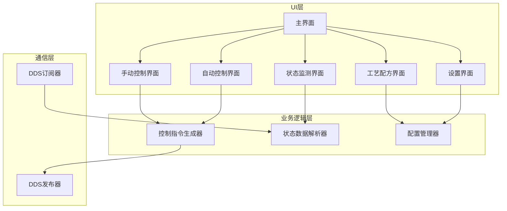

#### 2.2.2 控制流程

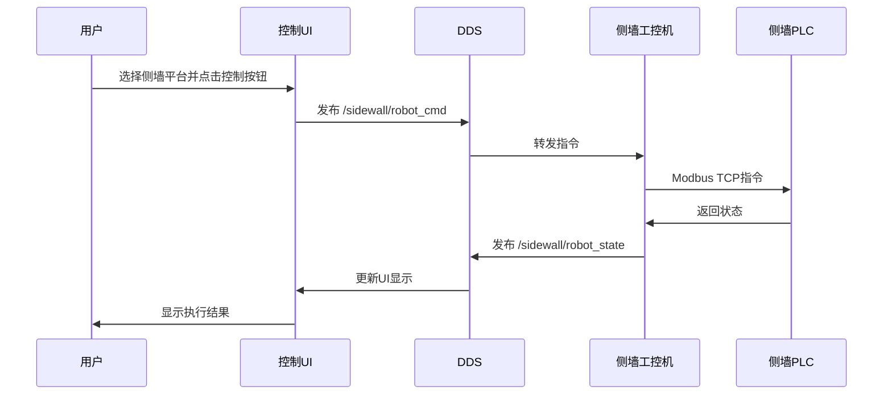

**说明**：
- 底板平台使用 `/floor/*` 命名空间，流程相同
- 单设备急停发布到 `/sidewall/emergency_stop`，仅影响该设备
- 系统级急停发布到 `/emergency_stop_all`（带前缀斜杠），影响所有设备

---

### 2.3 远程可视化管理平台架构

#### 2.3.1 功能模块

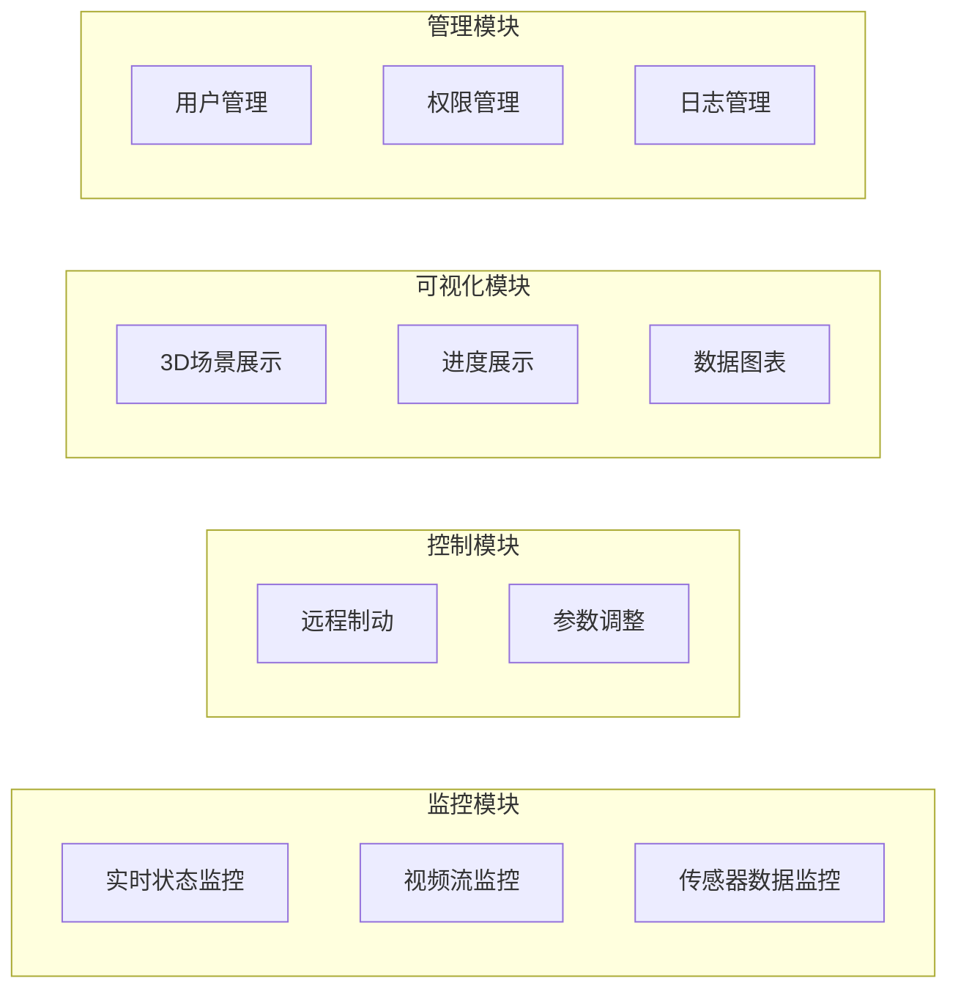

---

## 3. 通信架构

### 3.1 DDS通信机制

#### 3.1.1 Topic设计

**设备专用Topic**（带命名空间，以侧墙平台为例）：

| Topic名称 | 数据类型 | QoS | 发布者 | 订阅者 | 频率 |
|-----------|----------|-----|--------|--------|------|
| /sidewall/robot_state | RobotState | Reliable | 工控机 | 控制系统、管理平台 | 10Hz |
| /sidewall/robot_cmd | RobotCommand | Reliable | 控制系统 | 工控机 | 事件触发 |
| /sidewall/emergency_stop | EmergencyStop | Reliable | 控制系统、管理平台 | 工控机 | 事件触发 |
| /sidewall/heartbeat | Heartbeat | Reliable | 工控机 | 控制系统、管理平台 | 1Hz |
| /sidewall/camera/image | Image | BestEffort | 工控机 | 管理平台 | 5Hz |
| /sidewall/scan | LaserScan | Reliable | 工控机 | 导航节点 | 10Hz |
| /sidewall/defects | DefectArray | Reliable | 缺陷检测节点 | 管理平台 | 1Hz |
| /sidewall/progress | Progress | Reliable | 工控机 | 控制系统、管理平台 | 1Hz |
| /sidewall/diagnostics | DiagnosticArray | Reliable | 诊断节点 | 管理平台 | 1Hz |
| /sidewall/battery_state | BatteryState | Reliable | 电池监控节点 | 控制系统、管理平台、诊断节点 | 1Hz |
| /sidewall/audio | AudioData | BestEffort | 语音播报节点 | 扬声器 | 事件触发 |

**全局共享Topic**（真正的全局，必须带斜杠前缀）：

| Topic名称 | 数据类型 | QoS | 发布者 | 订阅者 | 频率 | 用途 |
|-----------|----------|-----|--------|--------|------|------|
| /emergency_stop_all | EmergencyStopAll | Reliable | 管理平台 | 所有工控机 | 事件触发 | 系统级紧急停止 |
| /diagnostics_agg | DiagnosticArray | Reliable | 诊断聚合节点 | 管理平台 | 1Hz | 系统健康状态聚合 |
| /time_sync | TimeSync | BestEffort | 管理平台（可选） | 所有设备 | 10Hz | 时间同步（可选） |

**命名规则**：
- **设备专用**：`/<robot_id>/<topic_name>` （推荐，大部分Topic）
- **全局共享**：`/<topic_name>` （带前缀斜杠，极少使用）
- **robot_id枚举**：`sidewall`（侧墙）、`floor`（底板）、`epoxy`（环氧砂浆）

**设计原则**：
- 设备应该能够**独立启动和工作**，不依赖管理平台
- 急停、心跳等关键功能使用设备自己的命名空间
- 全局Topic仅用于真正需要广播的场景（如系统级紧急停止所有设备）

**ROS2命名解析规则**：
```python
# 在命名空间 /sidewall 下的节点
Node(namespace='sidewall')

# 相对名称（会加上命名空间）
'cmd_vel'  →  '/sidewall/cmd_vel'

# 全局名称（不受命名空间影响）
'/emergency_stop_all'  →  '/emergency_stop_all'
```

#### 3.1.2 QoS配置

ROS2 DDS通信采用不同的QoS策略优化实时性、可靠性和带宽：

| Topic类型 | Reliability | Durability | Deadline | 说明 |
|----------|-------------|------------|----------|------|
| 控制指令 | RELIABLE | TRANSIENT_LOCAL | 100ms | 高可靠性，确保命令必达 |
| 传感器数据 | BEST_EFFORT | VOLATILE | 200ms | 高吞吐量，允许丢包 |
| 状态数据 | RELIABLE | TRANSIENT_LOCAL | - | 可靠性优先，保留最近10条 |

> 详细的QoS配置YAML见 **[04_详细设计文档 - 4.3节](04_详细设计文档.md#43-qos配置文件)**

#### 3.1.3 DDS域隔离方案（备选）

除了命名空间方案，还可以使用DDS Domain ID进行网络隔离：

| 设备 | Domain ID | 适用场景 |
|------|-----------|----------|
| 所有设备（默认） | 0 | 推荐：同一域便于跨设备通信 |
| 侧墙平台 | 1 | 备选：完全隔离场景 |
| 底板平台 | 2 | 备选：完全隔离场景 |
| 环氧砂浆设备 | 3 | 备选：完全隔离场景 |
| 管理平台 | 0（监听1,2,3） | 需要DDS桥接多域 |

**推荐方案**：采用**命名空间方案**（Domain ID = 0），理由：
- 简化配置，所有设备在同一DDS域
- 便于系统级消息广播（如 `emergency_stop_all`）
- 管理平台可直接订阅所有设备Topic
- 设备可独立启动，不依赖管理平台
- 避免Domain ID桥接的复杂性

### 3.2 组网方案

#### 3.2.1 WIFI6方案（推荐）

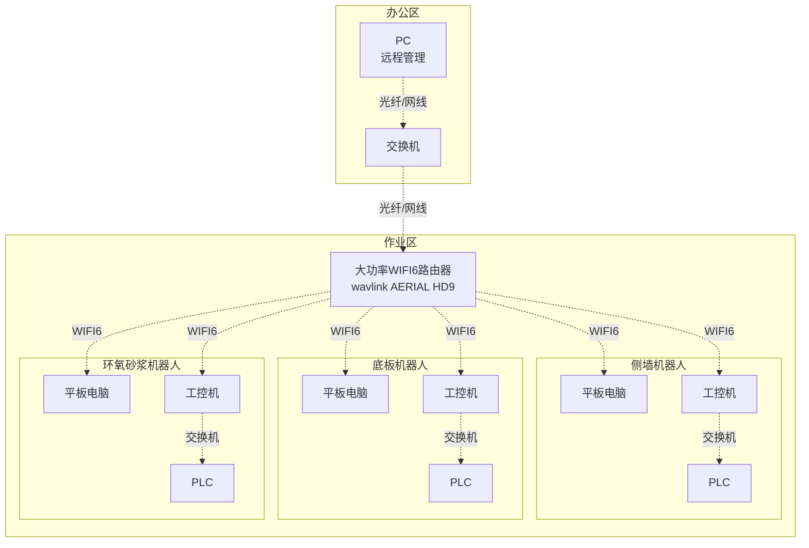

**覆盖范围**: 
- 单路由器: ~500m
- Mesh拓展: 最远可达3km

**带宽分配**:
- 总带宽: 1800Mbps (WIFI6)
- 控制指令: 优先级最高（<1Mbps）
- 传感器数据: 中优先级（~100Mbps/机器人）
- 视频流: 低优先级（~50Mbps/机器人）

**DDS网络配置**:
- 所有设备使用 Domain ID = 0
- 通过命名空间区分设备：`/sidewall`, `/floor`, `/epoxy`
- 设备独立Topic：`/sidewall/emergency_stop`, `/sidewall/heartbeat`
- 全局Topic（带前缀斜杠）：`/emergency_stop_all`, `/time_sync`（极少使用）

#### 3.2.2 4G/5G备用方案

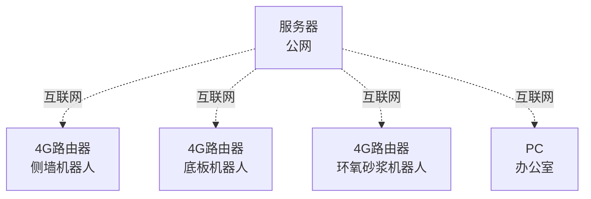

**适用场景**: WIFI6信号不稳定时自动切换

---

## 4. 数据架构

### 4.1 数据流图

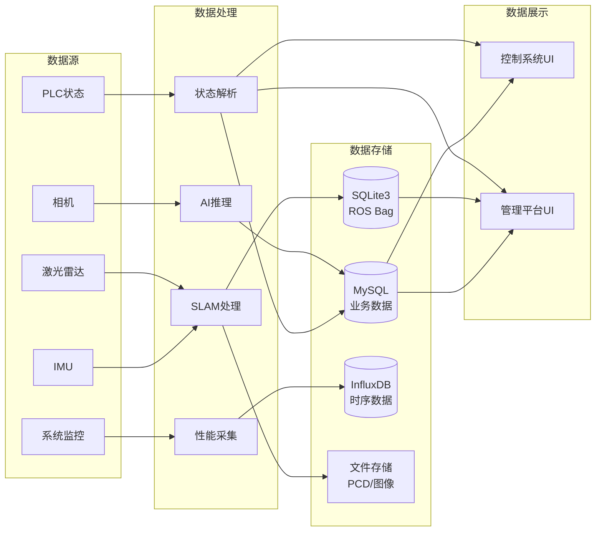

### 4.2 存储架构设计

本项目采用**混合存储架构**，针对不同类型数据选择最适合的存储方案：

```
┌─────────────────────────────────────────────────────────┐
│                    数据存储架构                          │
├─────────────────────────────────────────────────────────┤
│                                                          │
│  ┌────────────┐      ┌────────────┐      ┌───────────┐ │
│  │  SQLite3   │      │   MySQL    │      │ InfluxDB  │ │
│  │  (嵌入式)   │      │  (关系型)   │      │  (时序)   │ │
│  └────────────┘      └────────────┘      └───────────┘ │
│       ▲                   ▲                    ▲        │
│       │                   │                    │        │
│  ROS Bag数据          业务数据              实时监控数据   │
│  • 激光雷达           • 作业记录            • CPU/内存    │
│  • 相机图像           • 缺陷档案            • 温度/湿度    │
│  • IMU数据            • 厚度检测            • 位置/速度    │
│  • 导航路径           • 用户权限            • WIFI信号    │
│                                                          │
│  特点：               特点：                特点：        │
│  • 临时存储(1周)      • 永久存储            • 自动降采样   │
│  • 本地访问           • 远程访问            • 高频写入    │
│  • 便于传输           • 复杂查询            • 实时面板    │
└─────────────────────────────────────────────────────────┘
```

#### 4.2.1 SQLite3 - ROS Bag存储

**用途**: ROS2传感器数据录制（rosbag2默认后端）

**存储内容**:
- 激光雷达点云（/scan, 10Hz）
- 相机图像（/camera/image, 30fps）
- IMU数据（/imu, 100Hz）
- 导航路径（/nav/path, 1Hz）

**数据管理**:
- 保留周期：7天（定期清理旧bag）
- 单个bag大小：~2GB（录制30分钟）
- 存储路径：`/data/rosbags/YYYY-MM-DD_HH-MM-SS.db3`

**不涉及业务表设计** ✅

#### 4.2.2 MySQL - 业务数据管理

**用途**: 作业记录、缺陷档案、厚度检测等结构化业务数据

**核心表设计**（概要）:

```sql
-- 作业记录表
CREATE TABLE jobs (
    job_id INT PRIMARY KEY AUTO_INCREMENT,
    start_time DATETIME,
    end_time DATETIME,
    work_area VARCHAR(50),  -- 侧墙/底板
    operator VARCHAR(50),
    status ENUM('in_progress', 'completed', 'failed')
);

-- 缺陷数据表
CREATE TABLE defects (
    defect_id INT PRIMARY KEY AUTO_INCREMENT,
    job_id INT,
    detect_time DATETIME,
    position_x FLOAT,
    position_y FLOAT,
    defect_type VARCHAR(50),  -- 裂缝/孔洞/破损
    size_mm FLOAT,
    image_path VARCHAR(255),
    repair_status ENUM('pending', 'repaired', 'ignored'),
    FOREIGN KEY (job_id) REFERENCES jobs(job_id)
);

-- 厚度检测表
CREATE TABLE thickness_data (
    id INT PRIMARY KEY AUTO_INCREMENT,
    job_id INT,
    measure_time DATETIME,
    position_x FLOAT,
    position_y FLOAT,
    thickness_mm FLOAT,
    is_qualified BOOLEAN,
    FOREIGN KEY (job_id) REFERENCES jobs(job_id)
);

-- 用户权限表
CREATE TABLE users (
    user_id INT PRIMARY KEY AUTO_INCREMENT,
    username VARCHAR(50) UNIQUE,
    password_hash VARCHAR(255),
    role ENUM('admin', 'operator', 'viewer')
);
```

**部署方案**:
- 容器化部署：Docker MySQL 8.0
- 数据持久化：挂载 `/data/mysql` 到宿主机
- 网络访问：`3306`端口（内网开放）

**选择理由**:
1. **远程访问**: 办公室电脑可查询现场作业数据
2. **复杂查询**: 支持JOIN、子查询、视图、存储过程
3. **数据分析**: 可对接BI工具（缺陷统计、作业效率分析）

> 详细的表结构SQL、索引设计、数据库迁移策略见 **[05_接口设计文档 - 4.2节](05_接口设计文档.md#42-mysql表结构)**

#### 4.2.3 InfluxDB - 实时监控数据（可选）

**用途**: 高频时序数据采集与监控

**适用场景**:
- 系统性能监控（CPU、内存、温度）
- 机器人实时状态（位置、速度、电压）
- 环境数据（温湿度、WIFI信号强度）

**核心优势**:
1. **高吞吐写入**: 百万级points/秒
2. **自动降采样**: 1秒数据保留1周，1分钟数据保留1年
3. **时间查询语法**: `SELECT * FROM cpu WHERE time > now() - 1h`
4. **Grafana集成**: 一键配置实时监控面板

**部署方案**（可选）:
- 容器化：Docker InfluxDB 2.x
- 数据源：ROS2节点定期发布系统指标
- 可视化：Grafana实时面板

**优先级**: ⚠️ **中等**（锦上添花，非核心功能）

> 详细的InfluxDB数据模型、Retention Policy配置见 **[05_接口设计文档 - 4.3节](05_接口设计文档.md#43-influxdb时序数据)**

### 4.3 数据存储策略

| 数据类型 | 存储位置 | 保留时长 | 备份策略 |
|----------|----------|----------|----------|
| 传感器原始数据（ROS Bag） | SQLite3（工控机SSD） | 7天 | 不备份 |
| 业务数据（缺陷、厚度、作业记录） | MySQL（工控机Docker） | 永久 | 每日自动备份 |
| 时序监控数据 | InfluxDB（可选，工控机Docker） | 1周（1秒数据）<br/>1年（1分钟数据） | 不备份 |
| 3D模型（PCD） | 工控机SSD | 永久 | 手动备份 |
| 缺陷图像 | 工控机SSD | 永久 | MySQL记录路径 |
| 系统日志 | 工控机SSD | 30天 | 每周备份 |
| 视频录像 | 工控机SSD | 3天 | 不备份 |

---

## 5. 关键设计

### 5.1 场景建模方案

#### 5.1.1 技术方案
- **算法**: FAST-LIVO2（激光+IMU+视觉融合）
- **部署方式**: 独立模块，ROS1环境
- **数据传输**: 通过scp传输PCD文件

#### 5.1.2 工作流程

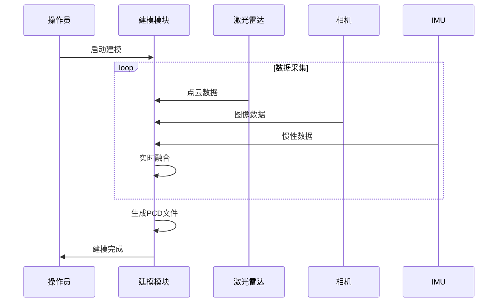

### 5.2 定位导航方案

#### 5.2.1 技术方案
- **框架**: ROS2 NAV2
- **定位**: AMCL（自适应蒙特卡洛定位）
- **规划器**: Regulated Pure Pursuit
- **控制器**: DWB (Dynamic Window Approach)

#### 5.2.2 导航流程


### 5.3 缺陷检测方案

#### 5.3.1 技术方案
- **算法**: YOLO v12
- **输入**: 高精度相机图像（31MP）
- **输出**: 缺陷类型、位置、置信度

#### 5.3.2 检测流程

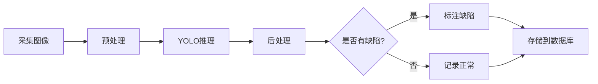

---

## 6. 部署视图

### 6.1 硬件部署

详见 [附录A_硬件选型清单](./附录/A_硬件选型清单.md)

### 6.2 软件部署

#### 6.2.1 工控机软件部署

**部署架构概览**：

```
工控机 (宸曜 Nuvo-10003-MH5)
├── Ubuntu 22.04 LTS
├── ROS2 Humble
│   ├── ROS2 Control框架 (controller_manager, Hardware Interface, Controllers)
│   ├── 应用层节点 (传感器驱动、SLAM、导航、检测、监控、诊断等)
│   └── NAV2导航栈
├── Systemd服务 (开机自启动，由robot_upstart生成)
├── Docker容器
│   ├── FAST-LIVO2 (ROS1 Noetic一次性建模)
│   ├── MySQL 8.0 (业务数据管理)
│   └── InfluxDB 2.x (可选，时序监控数据)
├── AI推理引擎 (YOLO v12 - RTX 4060 Ti 16GB GPU加速)
└── 数据存储
    ├── SQLite3 (ROS bag录制，rosbag2默认)
    ├── MySQL (业务数据：作业记录、缺陷档案、厚度检测)
    └── InfluxDB (可选：系统监控、性能指标)
```

**架构说明**：
- PLC通信在Hardware Interface内部，不是独立节点
- Controller Manager管理所有控制器，50Hz更新频率
- 智能平台（侧墙、底板）启动全部节点
- 简化平台（环氧砂浆）仅启动基础节点（无底盘、SLAM、检测）
- 开机自启动通过robot_upstart配置systemd服务
- 电池+市电混合供电，battery_monitor_node监控电池状态和充电状态

> 详细的节点列表、依赖关系、systemd配置见 **[04_详细设计文档 - 6节](04_详细设计文档.md#6-部署配置)**

#### 6.2.2 控制系统部署

```
平板电脑 (亿道三防 MES PAD Q122J)
├── Ubuntu 22.04 LTS
├── ROS2 Humble
└── Qt应用程序
    ├── 控制UI
    └── ROS2通信库
```

#### 6.2.3 开机自启动配置

使用 **robot_upstart** 配置systemd服务实现ROS2系统的开机自启动。

**关键特性**：
- 等待网络就绪后启动
- 延迟启动确保硬件初始化完成
- 故障自动重启（10秒间隔）
- 支持多设备独立服务管理

**服务命名**：
- 侧墙平台：`epoxybot_sidewall.service`
- 底板平台：`epoxybot_floor.service`
- 环氧砂浆设备：`epoxybot_epoxy.service`

> 详细的安装命令、systemd服务文件配置见 **[04_详细设计文档 - 6.2.3节](04_详细设计文档.md)** (待创建)

---

## 7. 接口设计

本章节聚焦于接口架构概览。详细的接口定义（消息、服务、动作、Modbus协议、HTTP API等）见：

**[05_接口设计文档](05_接口设计文档.md)**

包含内容：
- **ROS2接口定义**：DefectArray、EmergencyStopAll、TaskProgress、RobotStatus等自定义消息
- **服务与动作**：StartTask、PLCCommand、NavigateToWaypoint、ExecuteTask等
- **Modbus协议规范**：完整的寄存器地址映射表、功能码说明、错误处理
- **HTTP API**：管理平台REST接口、认证机制、错误码规范
- **数据库接口**：MySQL表结构、InfluxDB时序数据（可选）

---

## 8. 安全设计

### 8.1 功能安全

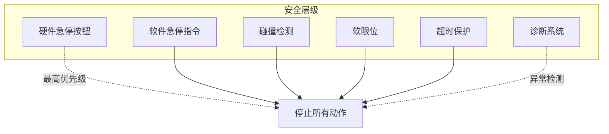

**诊断系统监控项**（概要）：

- **硬件状态**：工控机温度、电池状态、PLC通信、伺服电机状态
- **节点状态**：关键节点心跳、传感器数据更新频率
- **性能监控**：控制延迟、网络质量

> 详细的监控项、告警阈值、处理动作和诊断消息格式见 **[04_详细设计文档 - 3.1节](04_详细设计文档.md#31-diagnostics_node-诊断节点)**

### 8.2 信息安全

- **用户认证**: 用户名+密码
- **数据加密**: DDS传输加密（TLS）
- **权限管理**: 基于角色的访问控制（RBAC）
- **审计日志**: 记录所有关键操作

---

## 9. 性能设计

### 9.1 性能指标

| 指标 | 目标值 | 测试方法 |
|------|--------|----------|
| 控制指令延迟 | <100ms | 端到端时延测试 |
| 视频流延迟 | <1s | 网络延迟测试 |
| SLAM更新频率 | 10Hz | 性能分析工具 |
| AI推理速度 | >5FPS | GPU利用率监控 |
| 数据库查询响应 | <100ms | 压力测试 |

### 9.2 性能优化策略

- **多线程处理**: ROS2 MultiThreadedExecutor
- **GPU加速**: YOLO模型TensorRT优化
- **数据压缩**: 图像JPEG压缩传输
- **缓存机制**: 频繁查询数据缓存

---

## 10. 可维护性设计

### 10.1 日志策略

```python
# 日志级别
DEBUG    # 调试信息
INFO     # 正常运行信息
WARNING  # 警告信息
ERROR    # 错误信息
CRITICAL # 严重错误

# 日志格式
[时间] [级别] [模块名] [线程ID] 消息内容
```

### 10.2 故障诊断

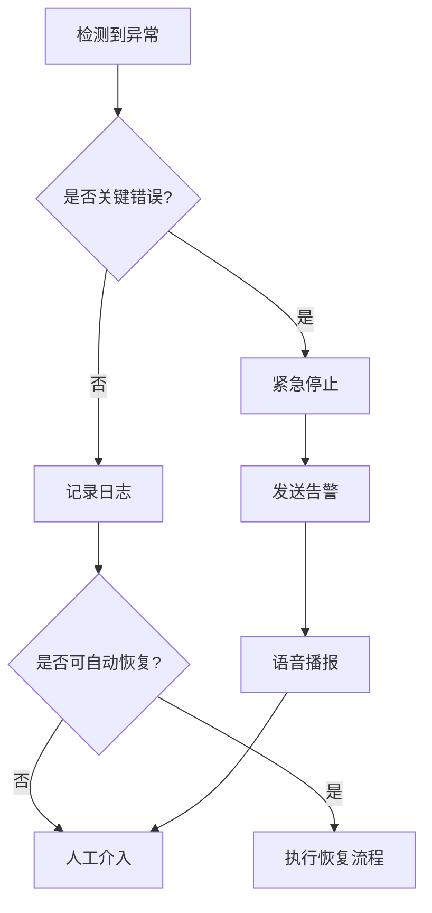

**诊断流程**：

1. **异常检测**：
   - 硬件传感器实时监控（温度、电压、电流）
   - ROS2节点心跳监测（diagnostic_updater）
   - PLC通信状态检查（Modbus超时检测）
   - 控制性能监控（延迟、频率）

2. **诊断聚合**（diagnostic_aggregator）：
   - 收集所有诊断信息
   - 按严重级别分类（OK/WARN/ERROR/STALE）
   - 生成系统健康报告

3. **告警机制**：
   - **日志记录**：所有异常写入日志文件
   - **DDS发布**：发布到`/diagnostics_agg` Topic
   - **语音播报**：严重错误触发语音告警（如"电池电量过低，请充电"）
   - **UI提示**：控制系统和管理平台显示告警

4. **自动恢复**：
   - 节点崩溃 → systemd自动重启
   - PLC通信中断 → 重连机制（3次重试）
   - 传感器异常 → 降级运行（禁用该传感器）
   - 电池低电量 → 自动返回充电桩（智能平台）

**语音播报机制**：

- 分为4个优先级：P0-紧急、P1-严重、P2-警告、P3-提示
- 基于规则引擎自动触发（监听 `/diagnostics_agg` 和 `/battery_state`）
- 支持冷却时间防止重复播报

> 详细的语音播报优先级表、告警规则配置见 **[04_详细设计文档 - 3.2节](04_详细设计文档.md#32-alert_node-语音播报节点)**

---

**下一步**: 查看 [04_接口设计文档](./04_接口设计文档.md) 了解详细接口定义
