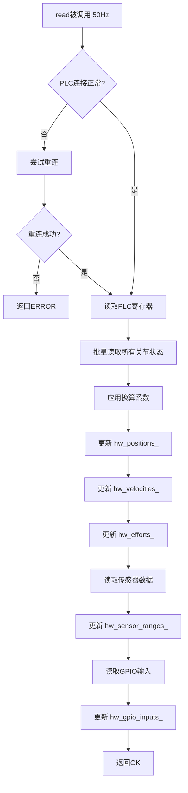
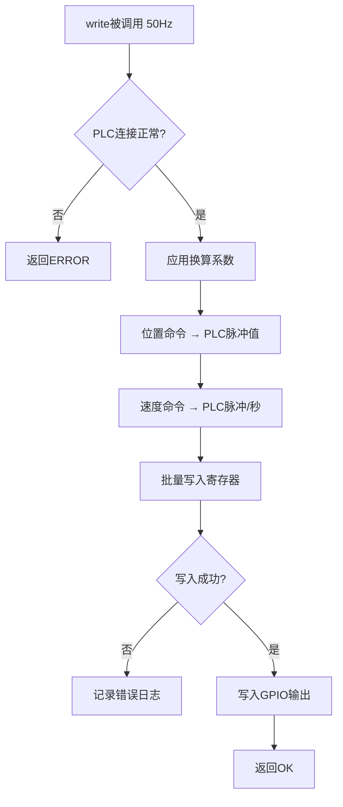
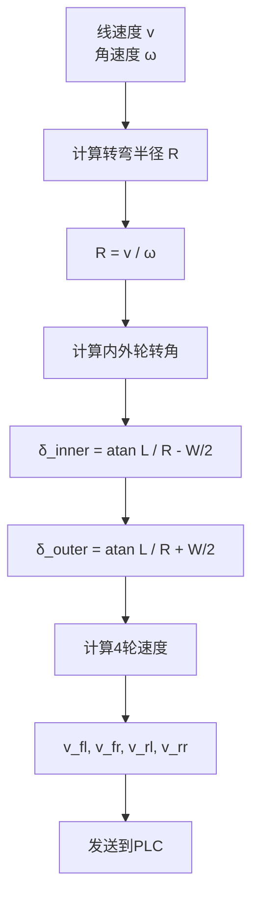
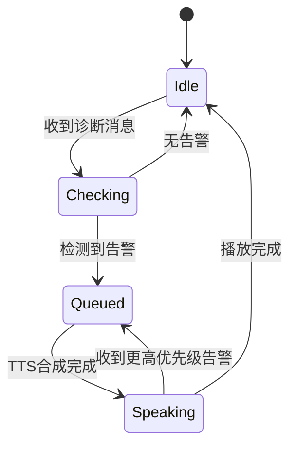
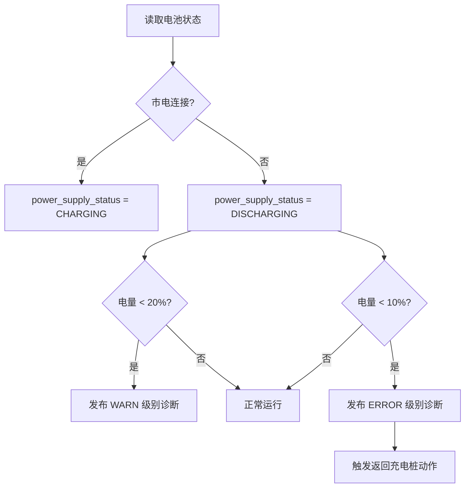

# 详细设计文档

**项目名称**：环氧砂浆施工平台软件系统  
**文档版本**：v1.0  
**编写日期**：2026-05-20  
**文档状态**：草稿

---

## 文档修订记录

| 版本 | 日期 | 修订内容 | 作者 |
|------|------|----------|------|
| v1.0 | 2026-05-20 | 初始版本，详细设计文档创建 | - |

---

## 目录

1. [硬件接口层详细设计](#1-硬件接口层详细设计)
2. [控制器配置详细设计](#2-控制器配置详细设计)
3. [应用层节点详细设计](#3-应用层节点详细设计)
4. [Launch文件与配置](#4-launch文件与配置)

---

## 1. 硬件接口层详细设计

### 1.1 EpoxybotSystemHardware 类设计

基于ROS2 Control框架的硬件接口实现。

#### 1.1.1 类结构

```cpp
namespace epoxybot_hardware {

class EpoxybotSystemHardware : public hardware_interface::SystemInterface
{
public:
  // 生命周期方法
  CallbackReturn on_init(const hardware_interface::HardwareInfo & info) override;
  CallbackReturn on_configure(const rclcpp_lifecycle::State & previous_state) override;
  CallbackReturn on_activate(const rclcpp_lifecycle::State & previous_state) override;
  CallbackReturn on_deactivate(const rclcpp_lifecycle::State & previous_state) override;
  
  // 状态接口导出
  std::vector<hardware_interface::StateInterface> export_state_interfaces() override;
  
  // 命令接口导出
  std::vector<hardware_interface::CommandInterface> export_command_interfaces() override;
  
  // 读写方法（50Hz）
  return_type read(const rclcpp::Time & time, const rclcpp::Duration & period) override;
  return_type write(const rclcpp::Time & time, const rclcpp::Duration & period) override;

private:
  // PLC通信客户端
  std::unique_ptr<PlcModbusClient> plc_client_;
  
  // 硬件状态
  std::vector<double> hw_positions_;      // 关节位置 (弧度/米)
  std::vector<double> hw_velocities_;     // 关节速度 (弧度/秒 或 米/秒)
  std::vector<double> hw_efforts_;        // 关节力矩 (N·m 或 N)
  
  // 硬件命令
  std::vector<double> hw_position_commands_;   // 位置命令
  std::vector<double> hw_velocity_commands_;   // 速度命令
  std::vector<double> hw_effort_commands_;     // 力矩命令（预留）
  
  // 传感器状态
  std::vector<double> hw_sensor_ranges_;  // 激光测距仪读数 (mm)
  std::vector<double> hw_sensor_forces_;  // 力传感器读数 (N)
  
  // GPIO状态
  std::vector<uint8_t> hw_gpio_inputs_;   // GPIO输入（急停、限位）
  std::vector<uint8_t> hw_gpio_outputs_;  // GPIO输出（指示灯、继电器）
  
  // Modbus映射表
  std::vector<JointPLCMapping> joint_mappings_;
  
  // 配置参数
  std::string plc_ip_;
  int plc_port_;
  std::string robot_type_;  // "sidewall", "floor", "epoxy"
};

} // namespace epoxybot_hardware
```

#### 1.1.2 关键数据结构

```cpp
// Modbus寄存器映射
struct JointPLCMapping {
  std::string joint_name;           // 关节名称（如 "front_left_steering"）
  uint16_t position_address;        // 位置反馈寄存器地址
  uint16_t velocity_address;        // 速度反馈寄存器地址
  uint16_t effort_address;          // 力矩反馈寄存器地址
  uint16_t position_cmd_address;    // 位置命令寄存器地址
  uint16_t velocity_cmd_address;    // 速度命令寄存器地址
  double position_scale;            // 位置换算系数（脉冲->弧度）
  double velocity_scale;            // 速度换算系数（脉冲/秒->弧度/秒）
  double effort_scale;              // 力矩换算系数（编码器->N·m）
};
```

---

### 1.2 PlcModbusClient 实现

#### 1.2.1 类接口

```cpp
class PlcModbusClient {
public:
  PlcModbusClient(const std::string& ip, int port);
  ~PlcModbusClient();
  
  // 连接管理
  bool connect();
  void disconnect();
  bool is_connected() const;
  
  // Modbus读写（功能码03：读保持寄存器）
  bool read_holding_registers(uint16_t start_addr, uint16_t count, std::vector<uint16_t>& data);
  bool write_holding_register(uint16_t addr, uint16_t value);
  bool write_multiple_registers(uint16_t start_addr, const std::vector<uint16_t>& data);
  
  // 批量读取（优化性能）
  bool read_all_joint_states(const std::vector<JointPLCMapping>& mappings,
                             std::vector<double>& positions,
                             std::vector<double>& velocities,
                             std::vector<double>& efforts);
  
  // 批量写入
  bool write_all_joint_commands(const std::vector<JointPLCMapping>& mappings,
                                const std::vector<double>& position_cmds,
                                const std::vector<double>& velocity_cmds);

private:
  std::string ip_;
  int port_;
  int socket_fd_;
  std::mutex mutex_;  // 线程安全
  
  // 重连机制
  int reconnect_attempts_;
  static constexpr int MAX_RECONNECT_ATTEMPTS = 3;
};
```

#### 1.2.2 read() 方法流程



#### 1.2.3 write() 方法流程



---

### 1.3 Modbus寄存器映射表

#### 1.3.1 智能平台（侧墙/地坪）寄存器映射

**底盘关节（Ackermann）：**

| 关节名称 | 功能 | 位置反馈地址 | 速度反馈地址 | 位置命令地址 | 速度命令地址 | 位置换算 | 速度换算 |
|---------|------|-------------|-------------|-------------|-------------|----------|----------|
| front_left_steering | 左前转向 | 0x1000 | 0x1001 | 0x2000 | 0x2001 | 脉冲/10000 → rad | 脉冲/秒/1000 → rad/s |
| front_right_steering | 右前转向 | 0x1002 | 0x1003 | 0x2002 | 0x2003 | 脉冲/10000 → rad | 脉冲/秒/1000 → rad/s |
| front_left_drive | 左前驱动 | 0x1004 | 0x1005 | 0x2004 | 0x2005 | 脉冲/10000 → m | 脉冲/秒/1000 → m/s |
| front_right_drive | 右前驱动 | 0x1006 | 0x1007 | 0x2006 | 0x2007 | 脉冲/10000 → m | 脉冲/秒/1000 → m/s |
| rear_left_drive | 左后驱动 | 0x1008 | 0x1009 | 0x2008 | 0x2009 | 脉冲/10000 → m | 脉冲/秒/1000 → m/s |
| rear_right_drive | 右后驱动 | 0x100A | 0x100B | 0x200A | 0x200B | 脉冲/10000 → m | 脉冲/秒/1000 → m/s |

**机械臂关节：**

| 关节名称 | 功能 | 位置反馈地址 | 速度反馈地址 | 位置命令地址 | 速度命令地址 | 位置换算 | 速度换算 |
|---------|------|-------------|-------------|-------------|-------------|----------|----------|
| arm_joint1 | 机械臂关节1 | 0x1010 | 0x1011 | 0x2010 | 0x2011 | 脉冲/10000 → rad | 脉冲/秒/1000 → rad/s |
| arm_joint2 | 机械臂关节2 | 0x1012 | 0x1013 | 0x2012 | 0x2013 | 脉冲/10000 → rad | 脉冲/秒/1000 → rad/s |
| arm_joint3 | 机械臂关节3 | 0x1014 | 0x1015 | 0x2014 | 0x2015 | 脉冲/10000 → rad | 脉冲/秒/1000 → rad/s |

**传感器寄存器：**

| 传感器 | 功能 | 读取地址 | 数据类型 | 换算系数 |
|--------|------|---------|---------|----------|
| range_sensor_1 ~ 10 | 激光测距仪 | 0x3000 ~ 0x3009 | uint16 | 寄存器值 → mm |
| force_sensor_1 | 喷涂压力传感器 | 0x3010 | uint16 | 寄存器值/100 → N |

**GPIO寄存器：**

| GPIO | 功能 | 读取地址 | 写入地址 | 位定义 |
|------|------|---------|---------|--------|
| emergency_stop | 急停按钮 | 0x4000 | - | Bit 0: 1=按下 |
| limit_switch_x | X轴限位 | 0x4000 | - | Bit 1: 1=触发 |
| limit_switch_y | Y轴限位 | 0x4000 | - | Bit 2: 1=触发 |
| spray_valve | 喷涂阀门 | - | 0x5000 | Bit 0: 1=开启 |
| warning_light | 警示灯 | - | 0x5000 | Bit 1: 1=开启 |

#### 1.3.2 环氧砂浆设备寄存器映射

**简化配置（无底盘控制）：**

| 关节名称 | 功能 | 位置反馈地址 | 速度反馈地址 | 位置命令地址 | 速度命令地址 |
|---------|------|-------------|-------------|-------------|-------------|
| arm_joint1 | 机械臂关节1 | 0x1010 | 0x1011 | 0x2010 | 0x2011 |
| arm_joint2 | 机械臂关节2 | 0x1012 | 0x1013 | 0x2012 | 0x2013 |
| arm_joint3 | 机械臂关节3 | 0x1014 | 0x1015 | 0x2014 | 0x2015 |

**传感器配置（12个测距仪）：**

| 传感器 | 读取地址 | 用途 |
|--------|---------|------|
| range_sensor_1 ~ 12 | 0x3000 ~ 0x300B | 厚度检测（环氧设备多2个） |

---

## 2. 控制器配置详细设计

### 2.1 ackermann_steering_controller 配置

仅用于智能平台（侧墙、地坪），环氧设备不加载此控制器。

#### 2.1.1 参数配置文件

```yaml
# config/ackermann_steering_controller.yaml
ackermann_steering_controller:
  ros__parameters:
    # 控制频率
    update_rate: 50  # Hz
    
    # 车辆参数
    wheel_base: 1.2  # 前后轴距 (m)
    wheel_track: 0.8  # 左右轮距 (m)
    wheel_radius: 0.15  # 车轮半径 (m)
    
    # 关节映射
    steering_joints:
      - front_left_steering
      - front_right_steering
    
    drive_joints:
      - front_left_drive
      - front_right_drive
      - rear_left_drive
      - rear_right_drive
    
    # 命令接口
    command_interface: velocity  # 或 position
    
    # 状态发布
    publish_rate: 50.0  # Hz
    enable_odom_tf: true
    odom_frame_id: odom
    base_frame_id: base_link
    
    # 速度限制
    linear:
      x:
        max_velocity: 1.0  # m/s
        max_acceleration: 0.5  # m/s²
        max_deceleration: -1.0  # m/s²
    
    angular:
      z:
        max_velocity: 1.57  # rad/s (90°/s)
        max_acceleration: 1.0  # rad/s²
        max_deceleration: -2.0  # rad/s²
    
    # 转向限制
    steering:
      max_angle: 0.524  # rad (30°)
      angle_tolerance: 0.01  # rad
```

#### 2.1.2 Ackermann转向几何



**公式：**
- 转弯半径：`R = v / ω`
- 内侧转角：`δ_inner = atan(L / (R - W/2))`
- 外侧转角：`δ_outer = atan(L / (R + W/2))`
- 前左轮速：`v_fl = ω * sqrt((R - W/2)² + L²)`
- 前右轮速：`v_fr = ω * sqrt((R + W/2)² + L²)`
- 后轮速度：`v_rl = ω * (R - W/2)`, `v_rr = ω * (R + W/2)`

其中：
- `L` = 轴距 (wheel_base)
- `W` = 轮距 (wheel_track)
- `v` = 线速度
- `ω` = 角速度

---

### 2.2 joint_trajectory_controller 配置

用于机械臂控制，所有设备类型通用。

#### 2.2.1 参数配置文件

```yaml
# config/joint_trajectory_controller.yaml
manipulator_trajectory_controller:
  ros__parameters:
    update_rate: 50  # Hz
    
    # 关节列表
    joints:
      - arm_joint1
      - arm_joint2
      - arm_joint3
    
    # 命令接口（支持位置+速度）
    command_interfaces:
      - position
      - velocity
    
    # 状态接口
    state_interfaces:
      - position
      - velocity
    
    # 轨迹约束
    constraints:
      stopped_velocity_tolerance: 0.01  # rad/s
      goal_time: 0.5  # s
      
      arm_joint1:
        trajectory: 0.05  # rad
        goal: 0.01  # rad
      arm_joint2:
        trajectory: 0.05
        goal: 0.01
      arm_joint3:
        trajectory: 0.05
        goal: 0.01
    
    # 动作服务器
    action_monitor_rate: 20.0  # Hz
    allow_partial_joints_goal: false
    allow_integration_in_goal_trajectories: true
```

#### 2.2.2 轨迹插补算法

使用五次多项式插值（Quintic Polynomial）：

```
θ(t) = a₀ + a₁t + a₂t² + a₃t³ + a₄t⁴ + a₅t⁵
```

**约束条件：**
- 初始位置：`θ(0) = θ₀`
- 初始速度：`θ'(0) = v₀`
- 初始加速度：`θ''(0) = a₀`
- 终止位置：`θ(T) = θ_f`
- 终止速度：`θ'(T) = v_f`
- 终止加速度：`θ''(T) = a_f`

---

### 2.3 gpio_controller 配置

用于数字IO控制，所有设备类型通用。

```yaml
# config/gpio_controller.yaml
gpio_controller:
  ros__parameters:
    update_rate: 10  # Hz
    
    # GPIO输入（只读）
    gpios:
      - name: emergency_stop
        interface: digital_input
      - name: limit_switch_x
        interface: digital_input
      - name: limit_switch_y
        interface: digital_input
    
    # GPIO输出（可写）
      - name: spray_valve
        interface: digital_output
      - name: warning_light
        interface: digital_output
```

---

### 2.4 range_sensor_broadcaster 配置

```yaml
# config/range_sensor_broadcaster.yaml
range_sensor_broadcaster_1:
  ros__parameters:
    sensor_name: range_sensor_1
    frame_id: range_sensor_1_link
    radiation_type: 1  # INFRARED = 1
    field_of_view: 0.01  # rad (窄波束)
    min_range: 0.05  # m
    max_range: 2.0  # m

# 复制10次（智能平台）或12次（环氧设备）
```

---

## 3. 应用层节点详细设计

### 3.1 diagnostics_node 诊断节点

#### 3.1.1 节点功能

实时监控硬件状态，发布诊断信息到 `/diagnostics` Topic。

#### 3.1.2 监控项

| 监控项 | 检查方法 | 发布频率 | 告警阈值 |
|--------|---------|---------|----------|
| CPU温度 | 读取 `/sys/class/thermal/thermal_zone0/temp` | 1Hz | >80°C WARN, >90°C ERROR |
| GPU温度 | NVIDIA SMI API | 1Hz | >80°C WARN, >90°C ERROR |
| 磁盘使用率 | `statvfs()` | 0.1Hz | >80% WARN, >90% ERROR |
| 内存使用率 | `/proc/meminfo` | 1Hz | >80% WARN, >90% ERROR |
| PLC通信状态 | 监听Hardware Interface心跳 | 1Hz | 超时500ms ERROR |
| 网络延迟 | DDS统计信息 | 1Hz | >100ms WARN |

#### 3.1.3 代码结构

```cpp
class DiagnosticsNode : public rclcpp::Node {
public:
  DiagnosticsNode();
  
private:
  void timer_callback();
  void check_cpu_temperature(diagnostic_updater::DiagnosticStatusWrapper& stat);
  void check_gpu_temperature(diagnostic_updater::DiagnosticStatusWrapper& stat);
  void check_disk_usage(diagnostic_updater::DiagnosticStatusWrapper& stat);
  void check_memory_usage(diagnostic_updater::DiagnosticStatusWrapper& stat);
  void check_plc_communication(diagnostic_updater::DiagnosticStatusWrapper& stat);
  
  diagnostic_updater::Updater updater_;
  rclcpp::TimerBase::SharedPtr timer_;
};
```

---

### 3.2 alert_node 语音播报节点

#### 3.2.1 节点功能

订阅 `/diagnostics_agg` 和 `/battery_state`，根据规则触发语音播报。

#### 3.2.2 状态机



#### 3.2.3 告警规则配置

```yaml
# config/alert_rules.yaml
alert_node:
  ros__parameters:
    # TTS引擎
    tts_engine: "espeak"  # 或 piper, festival
    language: "zh-CN"
    volume: 80
    
    # 告警规则
    rules:
      # P0 - 紧急
      - name: emergency_stop
        priority: 0
        condition:
          topic: /diagnostics_agg
          field: level
          operator: ==
          value: ERROR
          name_contains: "emergency"
        message: "紧急停止，请检查设备"
        cooldown: 10.0  # 冷却时间10秒
        
      # P1 - 严重
      - name: battery_critical
        priority: 1
        condition:
          topic: /battery_state
          field: percentage
          operator: <
          value: 10
        message: "电池电量过低，请立即充电"
        cooldown: 30.0
        
      - name: plc_error
        priority: 1
        condition:
          topic: /diagnostics_agg
          field: level
          operator: ==
          value: ERROR
          name_contains: "PLC"
        message: "PLC通信故障，切换到安全状态"
        cooldown: 10.0
        
      # P2 - 警告
      - name: temperature_high
        priority: 2
        condition:
          topic: /diagnostics_agg
          field: level
          operator: ==
          value: WARN
          name_contains: "temperature"
        message: "设备温度过高，即将降速运行"
        cooldown: 60.0
        
      - name: battery_low
        priority: 2
        condition:
          topic: /battery_state
          field: percentage
          operator: <
          value: 20
        message: "电池电量较低，建议充电"
        cooldown: 120.0
```

---

### 3.3 battery_monitor_node 电池监控节点

#### 3.3.1 节点功能

监控电池状态，发布到 `/battery_state` Topic，支持混合供电（电池+市电）。

#### 3.3.2 数据来源

1. **电池管理系统（BMS）**：通过CAN总线或串口通信
2. **备选方案**：PLC Modbus寄存器读取

#### 3.3.3 发布消息类型

```cpp
// 使用标准消息 sensor_msgs/BatteryState
sensor_msgs::msg::BatteryState battery_state;

battery_state.header.stamp = now();
battery_state.header.frame_id = "battery";

battery_state.voltage = 48.2;              // V
battery_state.current = 2.5;               // A (负值表示放电)
battery_state.charge = 85.0;               // Ah
battery_state.capacity = 100.0;            // Ah
battery_state.design_capacity = 100.0;     // Ah
battery_state.percentage = 85.0;           // %
battery_state.power_supply_status = CHARGING;  // CHARGING / DISCHARGING / NOT_CHARGING
battery_state.power_supply_health = GOOD;  // GOOD / OVERHEAT / DEAD / COLD
battery_state.power_supply_technology = LION;  // LION / LIPO / LIFE
battery_state.present = true;
battery_state.cell_voltage = {3.7, 3.7, 3.7, ...};  // 每个电芯电压
battery_state.cell_temperature = {35.0, 36.0, ...};  // 每个电芯温度 (°C)
battery_state.location = "base_link";
battery_state.serial_number = "SN123456";
```

#### 3.3.4 混合供电逻辑



---

### 3.4 defect_detection_node 缺陷检测节点

#### 3.4.1 节点功能

使用YOLO v12对65MP高分辨率图像进行缺陷检测。

#### 3.4.2 处理流程


#### 3.4.3 配置文件

```yaml
# config/defect_detection.yaml
defect_detection_node:
  ros__parameters:
    # 相机配置
    camera_topic: /camera/image_raw
    camera_info_topic: /camera/camera_info
    
    # YOLO模型
    model_path: "/opt/epoxybot/models/yolo_v12_defect.onnx"
    confidence_threshold: 0.5
    nms_threshold: 0.4
    input_size: [640, 640]
    
    # 缺陷类别
    class_names:
      - crack          # 裂缝
      - hole           # 孔洞
      - unevenness     # 不平整
      - discoloration  # 变色
    
    # GPU加速
    use_gpu: true
    gpu_id: 0
    
    # 发布频率
    publish_rate: 1.0  # Hz（高分辨率图像处理较慢）
```

---

### 3.5 slam_node (FAST-LIVO2) 配置

仅用于一次性场景建模，不在日常运行时加载。

#### 3.5.1 传感器配置

```yaml
# config/fastlivo_config.yaml
common:
  lid_topic: "/livox/lidar"
  imu_topic: "/livox/imu"
  img_topic: "/livox/camera/image_raw"
  
lidar:
  lidar_type: 1  # 1: Livox
  scan_line: 6
  blind: 0.5  # m
  
imu:
  imu_en: true
  extrinsic_T: [0.0, 0.0, 0.0]
  extrinsic_R: [1.0, 0.0, 0.0,
                0.0, 1.0, 0.0,
                0.0, 0.0, 1.0]
  
camera:
  camera_en: true
  image_width: 1920
  image_height: 1080
  
mapping:
  voxel_size: 0.5  # m
  max_range: 100.0  # m
  save_pcd: true
  pcd_save_path: "/opt/epoxybot/maps/"
```

---

## 4. Launch文件与配置

### 4.1 robot.launch.py 完整实现

```python
#!/usr/bin/env python3
# Copyright 2026 epoxybot
# Licensed under the Apache License, Version 2.0

import os
from ament_index_python.packages import get_package_share_directory
from launch import LaunchDescription
from launch.actions import DeclareLaunchArgument, OpaqueFunction
from launch.substitutions import LaunchConfiguration
from launch_ros.actions import Node
from launch.conditions import IfCondition, UnlessCondition

def generate_launch_description():
    # 获取配置文件路径
    pkg_share = get_package_share_directory('epoxybot_bringup')
    
    # 声明Launch参数
    robot_type_arg = DeclareLaunchArgument(
        'robot_type',
        default_value='sidewall',
        description='Robot type: sidewall, floor, or epoxy'
    )
    
    namespace_arg = DeclareLaunchArgument(
        'namespace',
        default_value='',
        description='Robot namespace (e.g., /sidewall, /floor, /epoxy)'
    )
    
    use_sim_time_arg = DeclareLaunchArgument(
        'use_sim_time',
        default_value='false',
        description='Use simulation time'
    )
    
    # 配置文件路径
    def get_config_files(context):
        robot_type = LaunchConfiguration('robot_type').perform(context)
        namespace = LaunchConfiguration('namespace').perform(context)
        
        # URDF文件
        urdf_file = os.path.join(pkg_share, 'urdf', f'{robot_type}_robot.urdf.xacro')
        
        # ROS2 Control配置
        ros2_control_config = os.path.join(pkg_share, 'config', f'{robot_type}_ros2_control.yaml')
        
        # 控制器配置
        controller_config = os.path.join(pkg_share, 'config', 'controllers.yaml')
        
        # 判断是否为智能平台
        is_intelligent = robot_type in ['sidewall', 'floor']
        
        nodes = []
        
        # ========== 1. robot_state_publisher ==========
        robot_state_publisher = Node(
            package='robot_state_publisher',
            executable='robot_state_publisher',
            name='robot_state_publisher',
            namespace=namespace,
            output='screen',
            parameters=[{
                'use_sim_time': LaunchConfiguration('use_sim_time'),
                'robot_description': open(urdf_file).read()
            }]
        )
        nodes.append(robot_state_publisher)
        
        # ========== 2. controller_manager ==========
        controller_manager = Node(
            package='controller_manager',
            executable='ros2_control_node',
            name='controller_manager',
            namespace=namespace,
            output='screen',
            parameters=[
                ros2_control_config,
                controller_config,
                {'use_sim_time': LaunchConfiguration('use_sim_time')}
            ]
        )
        nodes.append(controller_manager)
        
        # ========== 3. joint_state_broadcaster ==========
        joint_state_broadcaster = Node(
            package='controller_manager',
            executable='spawner',
            name='joint_state_broadcaster_spawner',
            namespace=namespace,
            arguments=['joint_state_broadcaster'],
            output='screen'
        )
        nodes.append(joint_state_broadcaster)
        
        # ========== 4. ackermann_steering_controller（仅智能平台）==========
        if is_intelligent:
            ackermann_controller = Node(
                package='controller_manager',
                executable='spawner',
                name='ackermann_steering_controller_spawner',
                namespace=namespace,
                arguments=['ackermann_steering_controller'],
                output='screen'
            )
            nodes.append(ackermann_controller)
        
        # ========== 5. manipulator_trajectory_controller ==========
        manipulator_controller = Node(
            package='controller_manager',
            executable='spawner',
            name='manipulator_trajectory_controller_spawner',
            namespace=namespace,
            arguments=['manipulator_trajectory_controller'],
            output='screen'
        )
        nodes.append(manipulator_controller)
        
        # ========== 6. gpio_controller ==========
        gpio_controller = Node(
            package='controller_manager',
            executable='spawner',
            name='gpio_controller_spawner',
            namespace=namespace,
            arguments=['gpio_controller'],
            output='screen'
        )
        nodes.append(gpio_controller)
        
        # ========== 7-16. range_sensor_broadcaster（智能10个，环氧12个）==========
        num_range_sensors = 10 if is_intelligent else 12
        for i in range(1, num_range_sensors + 1):
            range_broadcaster = Node(
                package='controller_manager',
                executable='spawner',
                name=f'range_sensor_broadcaster_{i}_spawner',
                namespace=namespace,
                arguments=[f'range_sensor_broadcaster_{i}'],
                output='screen'
            )
            nodes.append(range_broadcaster)
        
        # ========== 智能平台专属节点 ==========
        if is_intelligent:
            # 激光雷达驱动（2个）
            lidar1 = Node(
                package='lslidar_driver',
                executable='lslidar_driver_node',
                name='lidar_front',
                namespace=namespace,
                parameters=[os.path.join(pkg_share, 'config', 'lidar_front.yaml')]
            )
            nodes.append(lidar1)
            
            lidar2 = Node(
                package='lslidar_driver',
                executable='lslidar_driver_node',
                name='lidar_rear',
                namespace=namespace,
                parameters=[os.path.join(pkg_share, 'config', 'lidar_rear.yaml')]
            )
            nodes.append(lidar2)
            
            # 相机驱动（MV-CH650）
            camera = Node(
                package='mvs_camera',
                executable='mvs_camera_node',
                name='defect_camera',
                namespace=namespace,
                parameters=[os.path.join(pkg_share, 'config', 'camera.yaml')]
            )
            nodes.append(camera)
            
            # 缺陷检测节点
            defect_detection = Node(
                package='epoxybot_perception',
                executable='defect_detection_node',
                name='defect_detection',
                namespace=namespace,
                parameters=[os.path.join(pkg_share, 'config', 'defect_detection.yaml')]
            )
            nodes.append(defect_detection)
            
            # 导航节点（NAV2）
            navigation = Node(
                package='nav2_bringup',
                executable='bringup_launch.py',
                name='navigation',
                namespace=namespace,
                parameters=[os.path.join(pkg_share, 'config', 'nav2_params.yaml')]
            )
            nodes.append(navigation)
        
        # ========== 所有设备通用节点 ==========
        # 安全监控节点
        safety_monitor = Node(
            package='epoxybot_control',
            executable='safety_monitor_node',
            name='safety_monitor',
            namespace=namespace,
            output='screen'
        )
        nodes.append(safety_monitor)
        
        # 诊断节点
        diagnostics = Node(
            package='epoxybot_diagnostics',
            executable='diagnostics_node',
            name='diagnostics',
            namespace=namespace,
            parameters=[os.path.join(pkg_share, 'config', 'diagnostics.yaml')]
        )
        nodes.append(diagnostics)
        
        # 语音播报节点
        alert = Node(
            package='epoxybot_alerts',
            executable='alert_node',
            name='alert',
            namespace=namespace,
            parameters=[os.path.join(pkg_share, 'config', 'alert_rules.yaml')]
        )
        nodes.append(alert)
        
        # 电池监控节点
        battery_monitor = Node(
            package='epoxybot_battery',
            executable='battery_monitor_node',
            name='battery_monitor',
            namespace=namespace,
            parameters=[os.path.join(pkg_share, 'config', 'battery.yaml')]
        )
        nodes.append(battery_monitor)
        
        return nodes
    
    return LaunchDescription([
        robot_type_arg,
        namespace_arg,
        use_sim_time_arg,
        OpaqueFunction(function=get_config_files)
    ])
```

---

### 4.2 ROS2 Control URDF配置示例

#### 4.2.1 侧墙平台 URDF片段

```xml
<!-- sidewall_robot.urdf.xacro -->
<robot name="sidewall_robot">
  <ros2_control name="epoxybot_system" type="system">
    <hardware>
      <plugin>epoxybot_hardware/EpoxybotSystemHardware</plugin>
      <param name="plc_ip">192.168.1.100</param>
      <param name="plc_port">502</param>
      <param name="robot_type">sidewall</param>
    </hardware>
    
    <!-- 底盘转向关节 -->
    <joint name="front_left_steering">
      <command_interface name="position">
        <param name="min">-0.524</param>
        <param name="max">0.524</param>
      </command_interface>
      <state_interface name="position"/>
      <state_interface name="velocity"/>
      <param name="modbus_position_address">0x1000</param>
      <param name="modbus_velocity_address">0x1001</param>
      <param name="modbus_position_cmd_address">0x2000</param>
      <param name="position_scale">0.0001</param>
      <param name="velocity_scale">0.001</param>
    </joint>
    
    <!-- 复制其他关节配置... -->
    
    <!-- 传感器 -->
    <sensor name="range_sensor_1">
      <state_interface name="range"/>
      <param name="modbus_address">0x3000</param>
      <param name="frame_id">range_sensor_1_link</param>
    </sensor>
    
    <!-- GPIO -->
    <gpio name="emergency_stop">
      <state_interface name="digital_input"/>
      <param name="modbus_address">0x4000</param>
      <param name="bit">0</param>
    </gpio>
    
    <gpio name="spray_valve">
      <command_interface name="digital_output"/>
      <param name="modbus_address">0x5000</param>
      <param name="bit">0</param>
    </gpio>
  </ros2_control>
</robot>
```

---

### 4.3 诊断配置示例

```yaml
# config/diagnostics.yaml
diagnostics_node:
  ros__parameters:
    # 发布频率
    publish_rate: 1.0  # Hz
    
    # 监控项配置
    monitors:
      cpu_temperature:
        enabled: true
        warn_threshold: 80.0  # °C
        error_threshold: 90.0
        thermal_zone: 0
        
      gpu_temperature:
        enabled: true
        warn_threshold: 80.0
        error_threshold: 90.0
        
      disk_usage:
        enabled: true
        warn_threshold: 80.0  # %
        error_threshold: 90.0
        monitored_paths:
          - /
          - /opt/epoxybot
          
      memory_usage:
        enabled: true
        warn_threshold: 80.0
        error_threshold: 90.0
        
      plc_communication:
        enabled: true
        timeout: 0.5  # s
        monitored_topic: /joint_states
        
      network_quality:
        enabled: true
        warn_latency: 100.0  # ms
        error_latency: 500.0
        warn_packet_loss: 5.0  # %
```

---

### 4.4 电池监控配置示例

```yaml
# config/battery.yaml
battery_monitor_node:
  ros__parameters:
    # 通信接口
    interface_type: "modbus"  # 或 "can", "serial"
    
    # Modbus配置
    plc_ip: "192.168.1.100"
    plc_port: 502
    voltage_address: 0x6000
    current_address: 0x6001
    soc_address: 0x6002  # State of Charge
    temperature_address: 0x6003
    status_address: 0x6004
    
    # 电池参数
    design_capacity: 100.0  # Ah
    nominal_voltage: 48.0  # V
    cell_count: 13  # 串联电芯数量（13S）
    
    # 告警阈值
    voltage_low: 42.0  # V
    voltage_critical: 39.0  # V
    temperature_high: 50.0  # °C
    temperature_critical: 60.0  # °C
    
    # 发布频率
    publish_rate: 1.0  # Hz
```

---

## 附录

### A. 技术参考

- [ROS2 Control文档](https://control.ros.org/)
- [Ackermann Steering Controller](https://github.com/ros-controls/ros2_controllers/tree/master/ackermann_steering_controller)
- [Diagnostic Updater](https://github.com/ros/diagnostics)
- [FAST-LIVO2 GitHub](https://github.com/hku-mars/FAST-LIVO2)

### B. 开发工具

- **调试工具**：`ros2 control list_controllers`, `ros2 topic echo /diagnostics`
- **可视化**：RViz2, PlotJuggler
- **性能分析**：`ros2 topic hz`, `ros2 topic bw`

### C. 常见问题

**Q1: PLC通信超时如何处理？**
A: Hardware Interface内部实现重连机制（最多3次），失败后返回ERROR，controller_manager会将机器人切换到安全状态。

**Q2: 如何调优控制器参数？**
A: 使用RViz2实时监控 `/joint_states` 和 `/cmd_vel`，结合PlotJuggler分析响应曲线，调整PID参数或速度限制。

**Q3: 诊断信息如何聚合？**
A: 使用 `diagnostic_aggregator` 节点订阅所有 `/diagnostics` Topic，按层级（硬件/网络/应用）聚合后发布到 `/diagnostics_agg`。

---

**文档结束**
