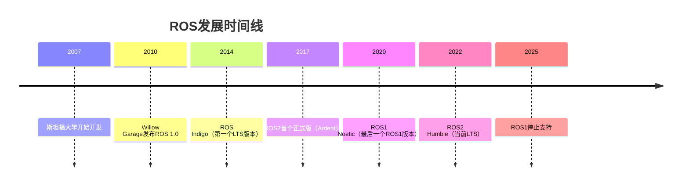
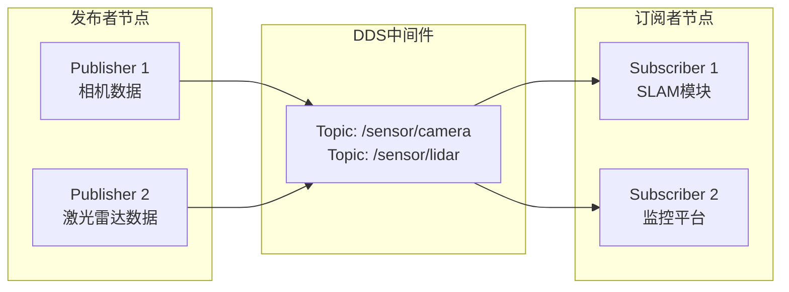
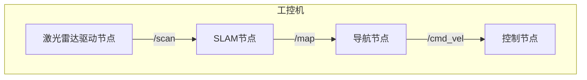
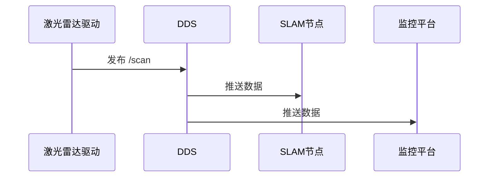
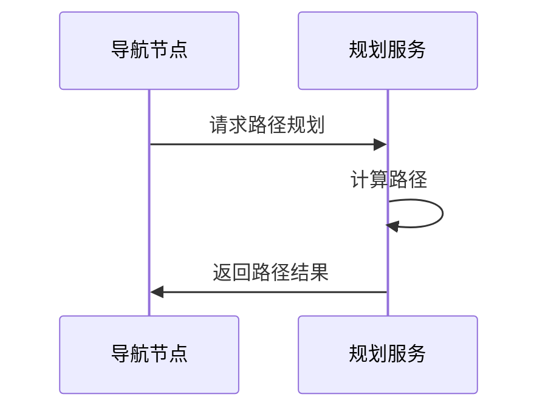
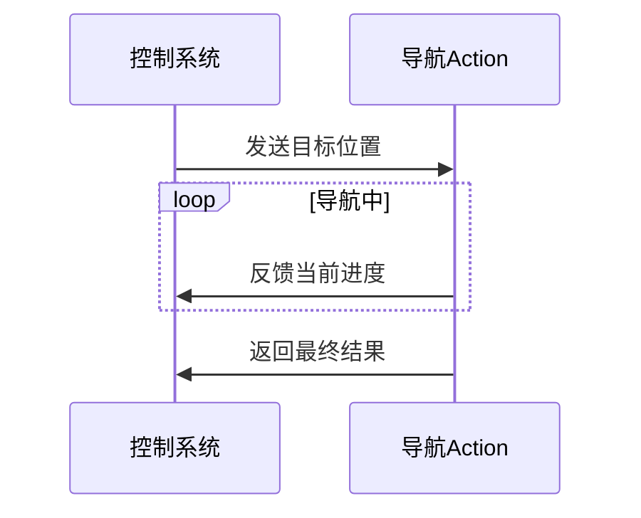

# 附录C: ROS2技术背景

> ROS2和DDS技术基础知识

---

## 1. 什么是ROS？

### 1.1 ROS简介

**ROS (Robot Operating System)** 是一个用于机器人软件开发的灵活框架，提供了：
- **通信机制**: 进程间数据交换
- **硬件抽象**: 统一的传感器/执行器接口
- **功能包**: 导航、SLAM、视觉等算法库
- **工具**: 可视化、调试、仿真

**注意**: ROS不是操作系统，而是运行在Linux（主要是Ubuntu）上的中间件框架。

---

### 1.2 ROS发展历史



---

### 1.3 ROS1 vs ROS2

| 特性 | ROS1 | ROS2 |
|------|------|------|
| **架构** | 中心化（Master） | 去中心化（DDS） |
| **实时性** | 软实时 | 支持硬实时 |
| **安全性** | 无 | DDS Security |
| **多机器人** | 需手动配置 | 自动发现 |
| **支持状态** | 2025年5月停止 | 持续开发 |

**为什么选择ROS2？**
1. ROS1即将停止支持
2. 本项目有2台智能平台+多个终端，去中心化架构更适合
3. 室外作业环境可能需要网络安全
4. 面向未来，避免技术债务

---

## 2. 什么是DDS？

### 2.1 DDS简介

**DDS (Data Distribution Service)** 是一个**工业级分布式通信中间件**，由**OMG (Object Management Group)** 标准化。

**核心特点**:
- **发布-订阅模式**: 数据生产者和消费者解耦
- **实时性**: 微秒级延迟
- **可靠性**: QoS配置，保证数据传输质量
- **自动发现**: 节点无需中心服务器
- **工业应用**: 航空、国防、医疗、金融

---

### 2.2 DDS通信模型



**工作流程**:
1. 发布者创建Topic并发送数据
2. DDS自动发现订阅者
3. 订阅者接收数据（根据QoS策略）
4. 无需中心Master，分布式架构

---

### 2.3 DDS实现对比

ROS2支持多种DDS实现：

| DDS实现 | 开发者 | 许可证 | 性能 | ROS2支持 |
|---------|--------|--------|------|---------|
| **FastDDS** | eProsima | Apache 2.0 | 高 | ✅ **默认** |
| CycloneDDS | Eclipse | EPL 2.0 | 中 | ✅ |
| ConnextDDS | RTI | 商业 | 极高 | ✅ |
| Gurum DDS | Gurum | 商业 | 高 | ✅ |

**本项目选择**: **FastDDS**（ROS2 Humble默认）

**理由**:
- 开源免费（Apache 2.0）
- ROS2官方默认，兼容性最好
- 性能优秀，满足需求
- 社区活跃，文档完善

---

### 2.4 QoS（服务质量）

DDS通过**QoS策略**控制数据传输特性：

#### 2.4.1 可靠性（Reliability）

| 策略 | 说明 | 适用场景 |
|------|------|----------|
| **RELIABLE** | 保证数据送达，丢失会重传 | 控制指令、状态数据 |
| **BEST_EFFORT** | 尽力传输，丢失不重传 | 传感器数据流 |

**示例**:
```python
from rclpy.qos import QoSProfile, ReliabilityPolicy

# 可靠传输（控制指令）
qos_reliable = QoSProfile(
    reliability=ReliabilityPolicy.RELIABLE,
    depth=10
)

# 尽力传输（激光雷达）
qos_best_effort = QoSProfile(
    reliability=ReliabilityPolicy.BEST_EFFORT,
    depth=10
)
```

---

#### 2.4.2 持久性（Durability）

| 策略 | 说明 | 适用场景 |
|------|------|----------|
| **TRANSIENT_LOCAL** | 保存最近N条消息，新订阅者可获取 | 地图数据、配置 |
| **VOLATILE** | 不保存历史，只收新数据 | 实时传感器数据 |

---

#### 2.4.3 截止时间（Deadline）

设置数据发布的最大间隔时间，超时则触发告警。

```python
from rclpy.qos import QoSProfile
from rclpy.duration import Duration

qos = QoSProfile(
    deadline=Duration(seconds=0, nanoseconds=100_000_000)  # 100ms
)
```

**应用**: 控制指令100ms内必须到达，否则视为通信故障。

---

#### 2.4.4 QoS组合示例

```yaml
# 控制指令 - 高可靠、低延迟
control_qos:
  reliability: RELIABLE
  durability: TRANSIENT_LOCAL
  deadline: 100ms
  history: KEEP_LAST
  depth: 10

# 传感器数据 - 高吞吐、可丢失
sensor_qos:
  reliability: BEST_EFFORT
  durability: VOLATILE
  history: KEEP_LAST
  depth: 5

# 地图数据 - 可靠、持久
map_qos:
  reliability: RELIABLE
  durability: TRANSIENT_LOCAL
  history: KEEP_LAST
  depth: 1
```

---

## 3. ROS2核心概念

### 3.1 节点（Node）

**节点**是ROS2程序的基本单元，每个节点负责特定功能。



**示例**:
```python
import rclpy
from rclpy.node import Node

class MyNode(Node):
    def __init__(self):
        super().__init__('my_node')
        self.get_logger().info('节点已启动')

rclpy.init()
node = MyNode()
rclpy.spin(node)
```

---

### 3.2 话题（Topic）

**话题**是数据传输的通道，采用**发布-订阅模式**。



**特点**:
- 一对多通信
- 异步传输
- 解耦设计

**命令行工具**:
```bash
# 查看所有Topic
ros2 topic list

# 查看Topic数据
ros2 topic echo /scan

# 查看Topic频率
ros2 topic hz /scan

# 发布数据
ros2 topic pub /cmd_vel geometry_msgs/msg/Twist "{linear: {x: 0.5}}"
```

---

### 3.3 服务（Service）

**服务**是请求-响应模式的同步通信。



**特点**:
- 一对一通信
- 同步等待响应
- 适合偶发操作

**示例**:
```python
# 调用服务
from std_srvs.srv import Trigger

client = node.create_client(Trigger, '/save_map')
request = Trigger.Request()
future = client.call_async(request)
rclpy.spin_until_future_complete(node, future)
response = future.result()
```

---

### 3.4 动作（Action）

**动作**是长时间运行的任务，支持**反馈**和**取消**。



**特点**:
- 支持取消
- 周期性反馈
- 适合导航、抓取等长任务

**应用场景**:
- 导航到目标点（NAV2）
- 机械臂运动规划（MoveIt2）

---

### 3.5 参数（Parameter）

**参数**用于节点配置，支持动态修改。

```python
# 声明参数
self.declare_parameter('max_speed', 1.0)

# 读取参数
max_speed = self.get_parameter('max_speed').value

# 设置参数回调
self.add_on_set_parameters_callback(self.parameter_callback)
```

**命令行工具**:
```bash
# 查看所有参数
ros2 param list

# 获取参数值
ros2 param get /my_node max_speed

# 设置参数
ros2 param set /my_node max_speed 2.0
```

---

## 4. ROS2文件系统

### 4.1 工作空间结构

```
~/epoxybot_ws/              # 工作空间根目录
├── src/                    # 源码目录
│   └── epoxybot/           # 功能包
│       ├── package.xml     # 功能包描述
│       ├── CMakeLists.txt  # 编译配置（C++）
│       ├── setup.py        # 编译配置（Python）
│       ├── launch/         # 启动文件
│       ├── config/         # 配置文件
│       ├── include/        # C++头文件
│       ├── src/            # C++源文件
│       └── scripts/        # Python脚本
├── build/                  # 编译中间文件
├── install/                # 安装目录
└── log/                    # 日志
```

---

### 4.2 package.xml

```xml
<?xml version="1.0"?>
<package format="3">
  <name>epoxybot</name>
  <version>1.0.0</version>
  <description>胶泥涂覆机器人软件包</description>
  <maintainer email="wangzq@example.com">王志强</maintainer>
  <license>Apache-2.0</license>

  <buildtool_depend>ament_cmake</buildtool_depend>
  
  <depend>rclcpp</depend>
  <depend>std_msgs</depend>
  <depend>geometry_msgs</depend>
  <depend>sensor_msgs</depend>
  <depend>nav2_msgs</depend>
  
  <export>
    <build_type>ament_cmake</build_type>
  </export>
</package>
```

---

### 4.3 Launch文件

Launch文件用于批量启动节点：

```python
# epoxybot.launch.py
from launch import LaunchDescription
from launch_ros.actions import Node

def generate_launch_description():
    return LaunchDescription([
        Node(
            package='epoxybot',
            executable='lidar_driver',
            name='lidar_front',
            parameters=[{'ip': '192.168.1.201'}]
        ),
        Node(
            package='epoxybot',
            executable='slam_node',
            name='slam',
            parameters=['/path/to/config.yaml']
        ),
    ])
```

**启动**:
```bash
ros2 launch epoxybot epoxybot.launch.py
```

---

## 5. ROS2常用工具

### 5.1 命令行工具

| 工具 | 功能 | 示例 |
|------|------|------|
| `ros2 node` | 节点管理 | `ros2 node list` |
| `ros2 topic` | Topic管理 | `ros2 topic list` |
| `ros2 service` | Service管理 | `ros2 service list` |
| `ros2 param` | 参数管理 | `ros2 param list` |
| `ros2 bag` | 数据录制回放 | `ros2 bag record /scan` |
| `ros2 launch` | 启动文件 | `ros2 launch pkg file.launch.py` |

---

### 5.2 可视化工具

#### 5.2.1 RViz2

3D可视化工具，用于查看：
- 激光雷达点云
- 相机图像
- 机器人模型
- 地图
- 路径规划

```bash
ros2 run rviz2 rviz2
```

---

#### 5.2.2 rqt工具集

| 工具 | 功能 |
|------|------|
| `rqt_console` | 日志查看器 |
| `rqt_graph` | 节点拓扑图 |
| `rqt_plot` | 数据实时绘图 |
| `rqt_image_view` | 图像查看器 |
| `rqt_reconfigure` | 动态参数调整 |

```bash
rqt  # 打开主界面，从菜单选择工具
```

---

## 6. ROS2数据录制与回放

### 6.1 录制数据

```bash
# 录制所有Topic
ros2 bag record -a

# 录制指定Topic
ros2 bag record /scan /camera/image_raw /imu

# 指定输出文件名
ros2 bag record -o my_bag /scan
```

---

### 6.2 回放数据

```bash
# 查看bag文件信息
ros2 bag info my_bag

# 回放
ros2 bag play my_bag

# 循环播放
ros2 bag play my_bag --loop
```

**用途**:
- 离线测试算法
- 重现故障场景
- 数据分析

---

## 7. ROS2学习资源

### 7.1 官方资源

- **官方文档**: https://docs.ros.org/en/humble/
- **教程**: https://docs.ros.org/en/humble/Tutorials.html
- **Discourse论坛**: https://discourse.ros.org/

---

### 7.2 推荐书籍

1. **《ROS2机器人编程实战》** - 古月居
2. **Programming Robots with ROS** - Morgan Quigley
3. **A Gentle Introduction to ROS** - Jason M. O'Kane

---

### 7.3 在线课程

- **古月学院**: https://www.guyuehome.com/
- **The Construct**: https://www.theconstructsim.com/
- **Udemy ROS2课程**

---

## 8. 快速上手示例

### 8.1 Hello World节点

```python
import rclpy
from rclpy.node import Node
from std_msgs.msg import String

class HelloNode(Node):
    def __init__(self):
        super().__init__('hello_node')
        self.publisher = self.create_publisher(String, 'hello_topic', 10)
        self.timer = self.create_timer(1.0, self.timer_callback)
        
    def timer_callback(self):
        msg = String()
        msg.data = 'Hello ROS2!'
        self.publisher.publish(msg)
        self.get_logger().info(f'发布: {msg.data}')

def main():
    rclpy.init()
    node = HelloNode()
    rclpy.spin(node)
    rclpy.shutdown()

if __name__ == '__main__':
    main()
```

**运行**:
```bash
python3 hello_node.py
```

**另一个终端监听**:
```bash
ros2 topic echo /hello_topic
```

---

## 9. 常见问题

### 9.1 ROS2找不到其他节点？

**原因**: DDS域不匹配或防火墙阻止

**解决**:
```bash
# 设置ROS域ID（0-101）
export ROS_DOMAIN_ID=42

# 关闭防火墙（测试用）
sudo ufw disable

# 或开放DDS端口（7400-7999）
sudo ufw allow 7400:7999/udp
```

---

### 9.2 Topic通信延迟高？

**原因**: QoS不匹配或网络拥堵

**解决**:
1. 检查QoS设置（发布者和订阅者要匹配）
2. 使用`BEST_EFFORT`减少延迟
3. 优化网络（5GHz WIFI6）

---

### 9.3 如何调试ROS2程序？

```bash
# 查看日志级别
ros2 run rqt_console rqt_console

# 设置日志级别
ros2 run --ros-args --log-level DEBUG my_package my_node

# 使用GDB调试C++节点
gdb --args ros2 run my_package my_node
```

---

**版本**: 1.0  
**最后更新**: 2026-05-19  
**维护者**: 王志强
